***

name: AIFirstPRDManager
description: AI-First 强约束新式 PRD 管理器，将传统 PRD 升级为 AI 可执行契约。遵循图表先行、逻辑后码原则，强制 10 阶段流水线执行，全链路可追溯。适用于需要严格流程控制的软件开发项目，确保需求不走样、AI 不跳步、错误可溯源。采用 Pipeline + Inversion + Reviewer 组合模式。
----------------------------------------------------------------------------------------------------------------------------------------------------------------------------

# AI-First 强约束新式 PRD 管理器

## 🎯 核心目标

将传统 PRD 升级为**人与 AI 共同遵守的可执行契约**，实现：

- ✅ **AI 可解析**：所有规则、流程、约束结构化，杜绝"凭感觉生成"
- ✅ **流程强固化**：强制遵循"图表先行、逻辑后码"，禁止 AI 跳过设计直接写代码
- ✅ **错误可溯源**：从需求到代码全链路关联，一键定位问题根源
- ✅ **能力可沉淀**：每个功能的开发经验沉淀为约束，避免重复踩坑
- ✅ **功能即 Skill**：每个功能独立闭环，达到 Skill 级的严谨性与复用性

## 🏗️ 目录结构

```
skills/AIFirstPRDManager/
├── SKILL.md                              # 本文件（主技能定义）
├── references/
│   ├── constraint-checklist.md          # AI 强约束清单（12 条铁律）
│   ├── trace-system.md                  # 全链路追溯体系规范
│   ├── error-diagnosis.md               # 错误诊断与闭环迭代流程
│   ├── phase-guidelines.md             # 10 个阶段详细指南
│   └── tech-stack-validation.md         # 🆕 技术栈最新性验证指南（6 维度框架）
└── assets/
    ├── project-template/                # 项目模板
    │   ├── docs/
    │   │   ├── project-constraint.yaml.template
    │   │   └── trace-total.md.template
    │   ├── scripts/
    │   └── resources/
    ├── feature-template/                # 功能模板
    │   ├── feature-meta.md.template
    │   ├── requirement-design.md.template
    │   ├── task-checklist.md.template
    │   └── specs/
    │       ├── 01-usecase.md.template
    │       ├── 02-activity.md.template
    │       ├── 03-component.md.template
    │       ├── 04-pert.md.template
    │       ├── 05-sequence.md.template
    │       ├── 06-er.md.template
    │       ├── 07-state-machine.md.template
    │       ├── 08-business-rules.md.template
    │       └── 09-gherkin.md.template
    └── examples/
        └── user-register-example/       # 用户注册实战示例
```

## 📋 使用说明

### 何时加载

在以下场景中，Agent 应该加载此技能：

- ✅ 启动新软件开发项目时
- ✅ 创建新功能模块时
- ✅ 需要严格遵循开发流程时
- ✅ 需要全链路追溯和错误诊断时
- ✅ 使用 AI 辅助开发且要求高质量输出时

### 如何使用

#### 1. 加载约束清单（必须第一步）

```
Load 'references/constraint-checklist.md' for the complete list of AI constraints.
```

#### 2. 加载追溯体系规范

```
Load 'references/trace-system.md' for traceability system rules.
```

#### 3. 加载阶段指南和技术验证规范

```markdown
Load 'references/phase-guidelines.md' for detailed phase execution guide.
Load 'references/tech-stack-validation.md' for tech stack validation rules (Phase 1.5).
```

#### 4. 执行 10 阶段流水线

严格按照以下顺序执行，**禁止跳过任何阶段**：

```markdown
阶段 0: 初始化与约束加载
    ↓ 【门禁：确认约束已加载】
阶段 1: 调研 → 可视化场景确认
    ↓ 【门禁：人工确认场景无遗漏】
阶段 1.5: 技术栈最新性验证 ← 🆕 新增
    ↓ 【门禁：技术选型确认通过】
阶段 2: 架构设计 → 系统蓝图锁定
    ↓ 【门禁：技术评审通过】
阶段 3: 任务分解 → 关键路径确认
    ↓ 【门禁：任务拆分合理】
阶段 4: 模块设计 → 接口与数据锁定
    ↓ 【门禁：接口一致性检查通过】
阶段 5: 规范定义 → 可执行规则锁定
    ↓ 【门禁：规范可执行性验证通过】
阶段 6: 测试设计 → 覆盖度验证
    ↓ 【门禁：覆盖率审查通过】
阶段 7: 小逻辑实现 → 逻辑先行编码
    ↓ 【门禁：单元测试全部通过】
阶段 8: 大逻辑集成 → 端到端验证
    ↓ 【门禁：业务场景测试通过】
阶段 9: 用户验收 → 操作引导
    ↓ 【门禁：用户确认功能符合预期】
最终交付
```

## 🔄 工作流程（Pipeline + Inversion 模式）

### ⚠️ 核心原则（必须遵守）

**Execute each phase in order. Do NOT skip any phase.**

**Do NOT proceed to next phase until current phase is confirmed by user.**

**All phases must have human confirmation gates.**

***

### Phase 0: 初始化与约束加载

**目标**：让 AI 先加载全局约束，再加载功能局部约束，确保从一开始就不跑偏

**AI 操作**：

1. 加载全局约束：`docs/project-constraint.yaml`、`references/constraint-checklist.md`
2. 加载当前功能的约束：`feature-meta.md` 元信息
3. 检查 `resources/error_cases.md` 中的历史错误案例

**输出**：

- 约束加载确认报告
- 历史案例警示列表

**门禁检查**：

```
✅ 全局技术约束已加载并理解
✅ 项目禁止项已明确
✅ 历史错误案例已查阅
✅ 当前功能范围已确认

请确认：
1. 技术栈是否符合预期？
2. 有没有遗漏的约束？
3. 可以进入阶段 1 吗？
```

**用户确认前不要继续！**

***

### Phase 1: 调研 → 可视化场景确认

**产出**：用例图、业务活动图

**AI 约束**：

- 必须覆盖所有主流程、分支、异常场景，**禁止遗漏边界情况**
- 所有场景必须明确标注"做 / 不做"，**避免 AI 臆造需求**

**详细步骤**：

#### Step 1.1: 收集需求信息

使用 Inversion 模式收集需求：

**Q1: 核心用户是谁？**

```
"这个功能的核心用户群体是什么？他们的技术水平如何？"
```

**Q2: 主要使用场景？**

```
"用户在什么情况下会使用这个功能？请描述 2-3 个典型场景。"
```

**Q3: 成功标准？**

```
"如何判断这个功能开发成功？有哪些关键指标？"
```

**Q4: 边界情况？**

```
"有哪些异常情况或边界条件需要处理？"
```

#### Step 1.2: 生成用例图

````markdown
# 用例图 - [功能名称]

## 参与者
- [参与者 1]
- [参与者 2]

## 用例列表

| 用例 ID | 用例名称 | 描述 | 优先级 |
|---------|---------|------|--------|
| UC-[001] | [用例名] | [描述] | P0/P1/P2 |

## 用例关系图（Mermaid）

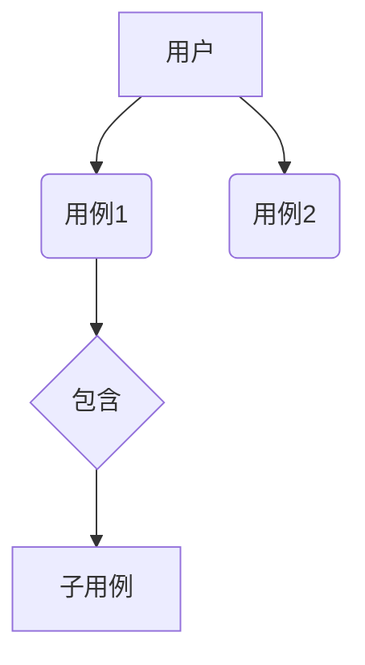
````

#### Step 1.3: 生成业务活动图

````markdown
# 业务活动图 - [功能名称]

## 主流程

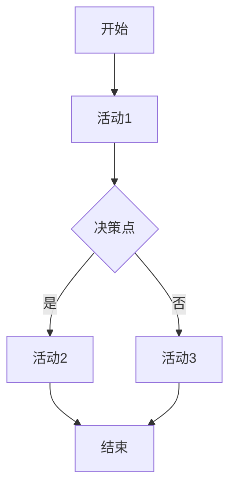

## 分支流程

[描述各分支的处理逻辑]

## 异常场景

| 异常 ID | 触发条件 | 处理方式 | 恢复策略 |
|---------|---------|---------|---------|
| EX-[001] | [条件] | [处理] | [恢复] |

````

**质量检查**：

- [ ] 所有主流程已覆盖
- [ ] 分支场景已识别
- [ ] 异常情况已处理
- [ ] 用例 ID 已生成
- [ ] 追溯记录已更新

**门禁检查**：

```
Phase 1 完成！

📊 产出物：
- 用例图：01-usecase.md ✓
- 业务活动图：02-activity.md ✓
- 用例总数：{count}
- 异常场景数：{count}

请确认：
1. 场景是否完整？有没有遗漏？
2. "不做"的边界是否清晰？
3. 可以进入阶段 2 吗？
```

**用户确认前不要继续！**

***

### Phase 1.5: 技术栈最新性验证 🆕

**目标**：在架构设计前，验证 `project-constraint.yaml` 中定义的技术栈是否为当前主流、活跃、未被废弃的技术，避免设计出落后或过时的架构

**⚠️ 核心原则**：

- **禁止在未验证技术栈最新性的情况下进行架构设计**
- **必须使用实时数据源验证，不能依赖 AI 的训练数据（可能已过时）**
- **发现技术过时时必须提出替代方案，由用户决策**

**AI 操作**：

#### Step 1.5.1: 提取待验证技术清单

从 `project-constraint.yaml` 和 `feature-meta.md` 中提取所有技术项：

```markdown
# 待验证技术清单 - [功能名称]

## 编程语言与运行时

| 技术 | 指定版本 | 用途 | 验证状态 |
|------|---------|------|---------|
| Python | 3.10+ | 主开发语言 | ☐ 待验证 |

## 框架与库

| 技术 | 指定版本 | 用途 | 类别 | 验证状态 |
|------|---------|------|------|---------|
| FastAPI | 0.100+ | Web 框架 | Web | ☐ 待验证 |
| SQLAlchemy | 2.0+ | ORM | 数据库 | ☐ 待验证 |

## 数据库与缓存

| 技术 | 指定版本 | 用途 | 验证状态 |
|------|---------|------|---------|
| MySQL | 8.0 | 主数据库 | ☐ 待验证 |
| Redis | 7.0 | 缓存 | ☐ 待验证 |

## 基础设施与工具

| 技术 | 指定版本 | 用途 | 验证状态 |
|------|---------|------|---------|
| Docker | 最新 | 容器化 | ☐ 待验证 |
| Nginx | 最新 | 反向代理 | ☐ 待验证 |
```

#### Step 1.5.2: 执行技术验证（使用 WebSearch 获取实时信息）

对每个技术项执行以下检查：

```markdown
### 技术验证报告 - [技术名称] [版本]

#### 基本信息
- **技术名称**: [名称]
- **指定版本**: [版本]
- **类别**: [编程语言/框架/数据库/工具]
- **用途**: [在项目中的用途]

#### 实时验证结果（WebSearch 获取）

**1. 最新稳定版本**
- 当前最新版: [X.Y.Z] (发布于 YYYY-MM-DD)
- 指定版本: [X.Y.Z]
- 版本差距: [描述]

**2. 维护状态**
- ✅ 积极维护 / ⚠️ 维护放缓 / ❌ 已停止维护 / ❌ 已废弃
- 最后发布日期: YYYY-MM-DD
- 发布频率: [频繁/正常/缓慢/停滞]
- GitHub Stars: [数量] (趋势: ↗️/➡️/↘️)
- Open Issues: [数量]
- Last Commit: [日期]

**3. 社区活跃度**
- Stack Overflow 月均提问数: [数量]
- npm/PyPI 周下载量: [数量] (趋势)
- Discord/Slack 社区人数: [数量]
- 年度会议/活动: [有/无]

**4. 安全状态**
- 近 6 个月 CVE 数量: [数量]
- 最高严重等级: [Critical/High/Medium/Low/None]
- 是否有已知未修复漏洞: 是/否

**5. 行业采用情况**
- 同类项目使用率: [高/中/低]
- 大公司采用案例: [列举]
- 替代方案成熟度: [高/中/低]

**6. 兼容性与迁移**
- 与指定版本的兼容性: [完全兼容/需适配/不兼容]
- 从旧版本迁移难度: [低/中/高]
- 文档完整度: [优秀/良好/一般/不足]

#### 验证结论

| 维度 | 评分 (1-5) | 说明 |
|-----|-----------|------|
| 版本新鲜度 | [X]/5 | [说明] |
| 维护活跃度 | [X]/5 | [说明] |
| 社区健康度 | [X]/5 | [说明] |
| 安全性 | [X]/5 | [说明] |
| 行业认可度 | [X]/5 | [说明] |
| **综合评分** | **[X]/5** | |

**推荐决策**: ✅ 推荐 / ⚠️ 有条件推荐 / ❌ 不推荐 / 🔴 必须替换

**理由**: [详细说明]

**如需替换，推荐的替代方案**:
1. [替代方案 1] - [理由]
2. [替代方案 2] - [理由]
```

#### Step 1.5.3: 生成技术验证汇总报告

````markdown
# 技术栈验证汇总报告 - [功能名称]

**验证时间**: YYYY-MM-DD HH:MM
**验证人**: AI + WebSearch 实时查询
**数据来源**: GitHub, PyPI/npm, Stack Overflow, Official Docs

## 总体评估

| 统计项 | 数量 | 占比 |
|-------|------|------|
| 总技术数 | {X} | 100% |
| ✅ 推荐使用 | {X} | {X}% |
| ⚠️ 有条件推荐 | {X} | {X}% |
| ❌ 不推荐 | {X} | {X}% |
| 🔴 必须替换 | {X} | {X}% |

## 详细结果

### ✅ 推荐使用（无需关注）

| 技术 | 版本 | 评分 | 状态说明 |
|------|------|------|---------|
| [技术] | [v] | 4.8/5 | 积极维护，社区活跃 |

### ⚠️ 有条件推荐（需注意）

| 技术 | 版本 | 评分 | 注意事项 | 建议 |
|------|------|------|---------|------|
| [技术] | [v] | 3.5/5 | [问题] | [建议] |

### ❌ 不推荐 / 🔴 必须替换（需要决策）

| 技术 | 版本 | 评分 | 问题详情 | 推荐替代方案 |
|------|------|------|---------|-------------|
| [技术] | [v] | 2.0/5 | [问题描述] | [替代方案] |

## 关键风险提示

### 🚨 高风险（必须在架构设计前解决）

**风险 1**: [技术] 已停止维护
- **影响**: [影响范围]
- **建议**: [具体建议]
- **用户决策 needed**: 是/否

**风险 2**: [技术] 存在严重安全漏洞
- **影响**: [影响范围]
- **建议**: [具体建议]
- **用户决策 needed**: 是/否

### ⚠️ 中等风险（建议在本迭代内处理）

**风险 3**: [描述]
- **影响**: [影响范围]
- **建议**: [具体建议]

## 更新后的技术栈建议

基于验证结果，建议更新 `project-constraint.yaml`：

```yaml
tech_stack:
  # 保持不变
  language: "Python 3.12+"  # ← 建议升级
  
  # 需要更新
  framework: "FastAPI 0.115+"  # ← 升级到最新 LTS
  
  # 建议替换
  # old_library: "deprecated-lib"  # ← 废弃
  new_library: "modern-alternative"  # → 新方案
```

````

#### Step 1.5.4: 用户确认技术选型

**门禁检查**：
```

Phase 1.5 完成！

📊 技术验证结果：

- 总验证技术数：{count}
- ✅ 推荐使用：{count}
- ⚠️ 有条件推荐：{count}
- ❌ 需要替换：{count}

🔴 需要您决策的问题：

1. \[技术 A] 已废弃，是否替换为 \[替代方案]？
2. \[技术 B] 版本过旧，是否升级到 \[新版本]？
3. \[技术 C] 社区萎缩，是否有备选方案？

请确认：

1. 技术验证报告是否准确？
2. 对"需要替换"的技术是否同意替换方案？
3. 最终确定的技术栈列表？
4. 可以进入阶段 2（架构设计）吗？

```

**用户确认前不要继续！**

**⚠️ 特别注意**：
- 如果存在 🔴 必须替换 的技术，**绝对不能进入 Phase 2**
- 用户必须明确确认每个有争议的技术选型
- 所有确认的变更必须同步更新到 `project-constraint.yaml`

---

### Phase 2: 架构设计 → 系统蓝图锁定

**产出**：组件图、部署图、技术依赖图

**AI 约束**：
- 必须严格遵循 `project-constraint.yaml` 中的技术栈
- **禁止擅自引入新的依赖/框架**
- 组件职责必须清晰，**禁止跨层调用**

**详细步骤**：

#### Step 2.1: 设计组件图

````markdown
# 组件图 - [功能名称]

## 组件清单

| 组件 ID | 组件名称 | 职责 | 技术栈 |
|---------|---------|------|--------|
| C-[001] | [名称] | [职责] | [技术] |

## 组件关系图（Mermaid）

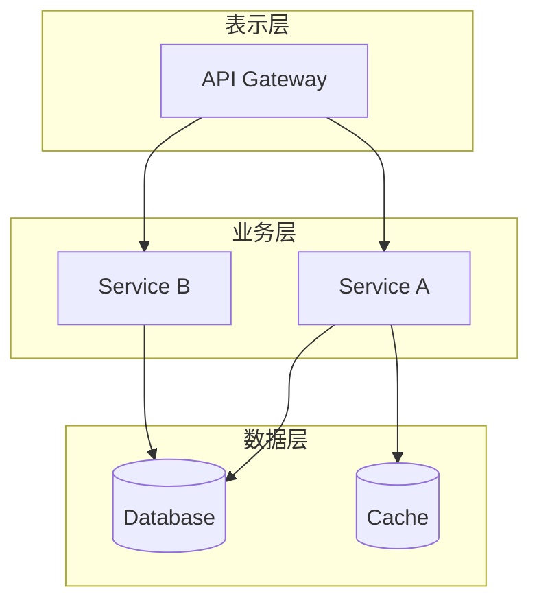

## 组件职责定义

### C-\[001]: \[组件名称]

- **职责**: \[详细说明]
- **输入**: \[输入列表]
- **输出**: \[输出列表]
- **依赖**: \[依赖组件]
- **约束**: \[特殊约束]
````

#### Step 2.2: 定义部署架构

````markdown
# 部署图

## 部署拓扑

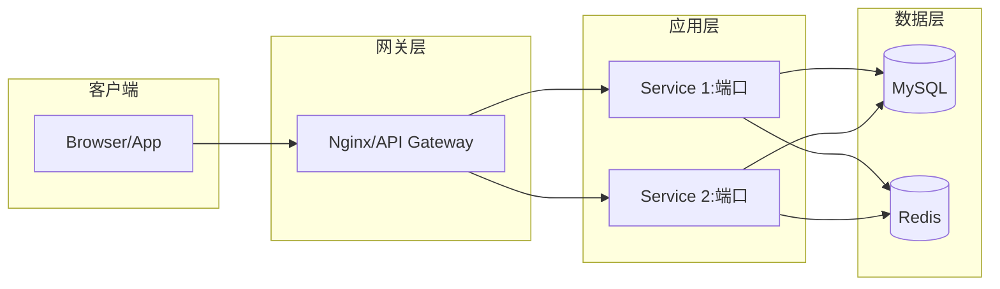
````

**质量检查**：

- [ ] 组件职责单一且清晰
- [ ] 无循环依赖
- [ ] 符合项目技术栈约束
- [ ] 组件 ID 已生成并关联用例 ID
- [ ] 追溯记录已更新

**门禁检查**：
````

Phase 2 完成！

📊 产出物：

- 组件图：03-component.md ✓
- 部署图：已包含 ✓
- 组件数量：{count}
- 依赖关系：已验证 ✓

请确认：

1. 架构是否符合项目标准？
2. 组件划分是否合理？
3. 可以进入阶段 3 吗？

````

**用户确认前不要继续！**

---

### Phase 3: 任务分解 → 关键路径确认

**产出**：PERT 图、任务清单 `plan.md`

**AI 约束**：
- 每个任务粒度控制在 1-2 天，**禁止超大任务**
- 依赖关系必须清晰，**禁止循环依赖**
- 必须识别关键路径，标注优先级

**详细步骤**：

#### Step 3.1: 创建 PERT 图

````markdown
# PERT 任务依赖图 - [功能名称]

## 任务清单

| 任务 ID | 任务名称 | 工期（天） | 前置任务 | 负责人 | 优先级 |
|---------|---------|-----------|---------|--------|--------|
| T-[001] | [任务] | 1-2 | 无 | AI/Dev | P0 |

## PERT 图（Mermaid）

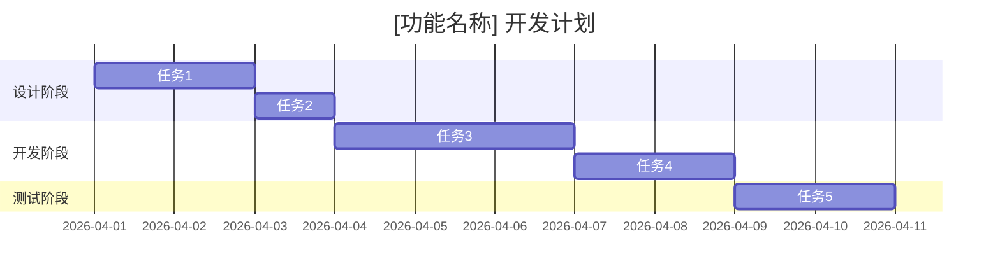

## 关键路径分析

**关键路径**: \[列出关键任务链]

**总工期**: {X} 天

**风险任务**: \[标注高风险任务]

````

#### Step 3.2: 生成任务清单

```markdown
# task-checklist.md - [功能名称]

## 任务概览

- 总任务数：{count}
- 关键路径任务：{count}
- 预计工期：{X} 天

## 详细任务

### T-[001]: [任务名称]

**描述**: [详细描述]

**验收标准**:
- [ ] [标准 1]
- [ ] [标准 2]

**关联组件**: C-[XXX]

**关联用例**: UC-[XXX]

**产出物**:
- [产出物 1]
- [产出物 2]
````

**质量检查**：

- [ ] 任务粒度合理（1-2 天）
- [ ] 依赖关系清晰无循环
- [ ] 关键路径已识别
- [ ] 优先级已标注
- [ ] 任务 ID 已关联组件/用例 ID

**门禁检查**：

```
Phase 3 完成！

📊 产出物：
- PERT 图：04-pert.md ✓
- 任务清单：task-checklist.md ✓
- 总任务数：{count}
- 关键路径长度：{X} 天
- 风险任务数：{count}

请确认：
1. 任务拆分粒度是否合适？
2. 依赖关系是否合理？
3. 可以进入阶段 4 吗？
```

**用户确认前不要继续！**

***

### Phase 4: 模块设计 → 接口与数据锁定

**产出**：模块职责表、接口时序图、ER 图

**AI 约束**：

- 接口必须与时序图完全一致，**每个箭头对应一次调用**
- 数据库设计必须满足第三范式，索引设计合理
- **禁止修改已确认的 ER 图字段**，除非走变更流程

**详细步骤**：

#### Step 4.1: 设计接口时序图

````markdown
# 接口时序图 - [功能名称]

## 接口清单

| 接口 ID | 方法 | 路径 | 描述 | 认证 |
|---------|------|------|------|------|
| API-[001] | POST | /api/xxx | [描述] | JWT |

## 时序图（Mermaid）

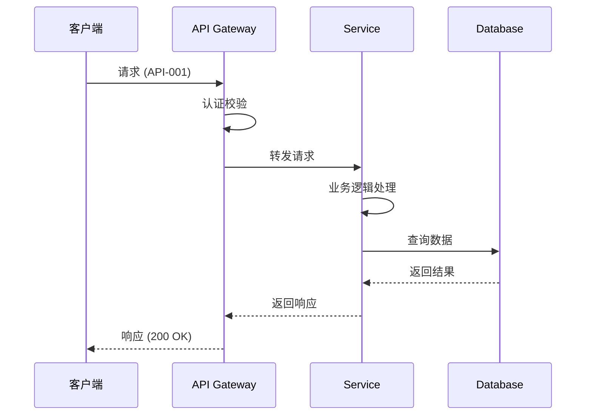

## 接口详细定义

### API-\[001]: \[接口名称]

**请求**:

```json
{
  "field1": "type",
  "field2": "type"
}
```

**响应**:

```json
{
  "code": 200,
  "data": {},
  "message": "success"
}
```

**错误码**:

| 错误码     | 说明    | HTTP 状态码 |
| ------- | ----- | -------- |
| ERR-001 | \[说明] | 400      |

````

#### Step 4.2: 设计数据库 ER 图

````markdown
# 数据库 ER 图 - [功能名称]

## ER 图（Mermaid）

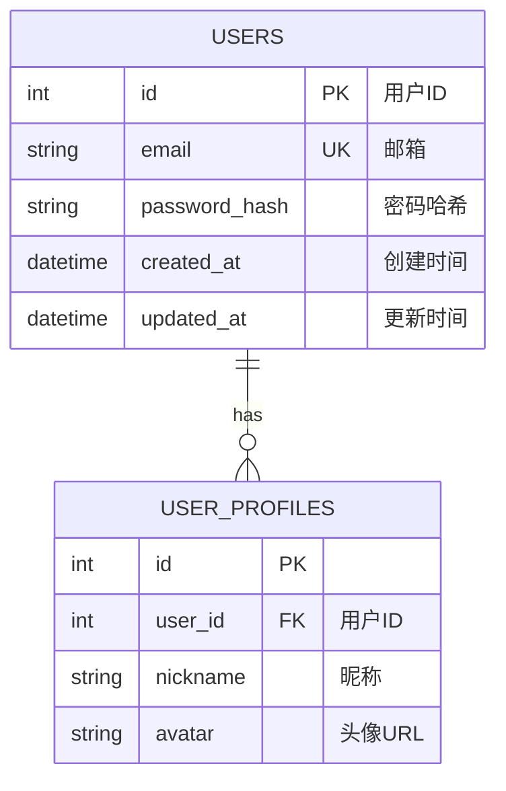

## 表结构详情

### users 表

| 字段名            | 类型           | 约束                  | 说明   |
| -------------- | ------------ | ------------------- | ---- |
| id             | INT          | PK, AUTO\_INCREMENT | 主键   |
| email          | VARCHAR(255) | UNIQUE, NOT NULL    | 邮箱   |
| password\_hash | VARCHAR(255) | NOT NULL            | 密码哈希 |
| created\_at    | DATETIME     | DEFAULT NOW()       | 创建时间 |
| updated\_at    | DATETIME     | ON UPDATE NOW()     | 更新时间 |

**索引**:

- idx\_users\_email (email) - UNIQUE

**约束**:

- 密码字段必须哈希存储（bcrypt）
- 邮箱必须唯一
````

**质量检查**：

- [ ] 时序图中每个箭头都有对应的接口定义
- [ ] ER 图满足第三范式
- [ ] 索引设计合理
- [ ] 接口/表字段 ID 已生成
- [ ] 追溯记录已更新

**门禁检查**：
````
Phase 4 完成！

📊 产出物：

- 接口时序图：05-sequence.md ✓
- ER 图：06-er.md ✓
- 接口数量：{count}
- 数据表数量：{count}

请确认：

1. 接口定义是否完整？
2. 数据模型是否符合需求？
3. 可以进入阶段 5 吗？

````

**用户确认前不要继续！**

---

### Phase 5: 规范定义 → 可执行规则锁定

**产出**：状态机图、规则表、Gherkin 场景

**AI 约束**：
- 状态流转必须无歧义，**禁止出现未定义的状态跳转**
- 业务规则必须表格化，**禁止模糊的自然语言描述**
- 每个 Gherkin 场景必须能映射到时序图/数据操作

**详细步骤**：

#### Step 5.1: 设计状态机图

````markdown
# 状态机图 - [功能名称]

## 状态流转图（Mermaid）

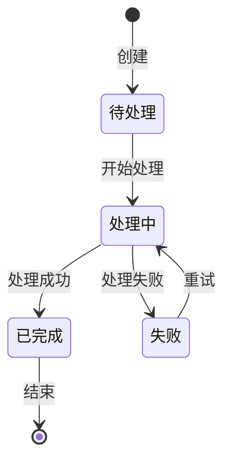

## 状态定义

| 状态  | 说明    | 进入条件  | 退出条件  |
| --- | ----- | ----- | ----- |
| 待处理 | \[说明] | \[条件] | \[条件] |
| 处理中 | \[说明] | \[条件] | \[条件] |
| 已完成 | \[说明] | \[条件] | \[条件] |
| 失败  | \[说明] | \[条件] | \[条件] |

## 状态转换规则

| 当前状态 | 事件   | 目标状态 | 守卫条件   | 动作   |
| ---- | ---- | ---- | ------ | ---- |
| 待处理  | 开始处理 | 处理中  | 无      | 分配资源 |
| 处理中  | 处理成功 | 已完成  | 校验通过   | 更新状态 |
| 处理中  | 处理失败 | 失败   | 异常发生   | 记录日志 |
| 失败   | 重试   | 处理中  | 重试次数<3 | 重新分配 |

````

#### Step 5.2: 定义业务规则表

````markdown
# 业务规则表 - [功能名称]

## 规则清单

| 规则 ID | 规则名称 | 类型 | 描述 | 优先级 |
|---------|---------|------|------|--------|
| R-[001] | [规则名] | 校验/转换/计算 | [描述] | P0 |

## 规则详情

### R-[001]: [规则名称]

**类型**: 校验 / 转换 / 计算

**触发条件**: [何时触发]

**规则内容**:

| 输入 | 条件 | 输出 | 示例 |
|------|------|------|------|
| [值] | [条件] | [结果] | [示例] |

**伪代码**:
```

IF condition THEN action
ELSE alternative\_action

```

**关联接口**: API-[XXX]

**测试用例**: TEST-[XXX]
````

#### Step 5.3: 编写 Gherkin 场景

````markdown
# Gherkin 场景规范 - [功能名称]

## Feature: [功能名称]

```gherkin
Feature: [功能名称]
  作为 [角色]
  我想要 [目标]
  以便于 [价值]

  Scenario: [场景 1 名称]
    Given [前置条件]
    When [操作]
    Then [预期结果]

  Scenario Outline: [参数化场景]
    Given [前置条件 <param>]
    When [操作 <param>]
    Then [预期结果 <param>]

    Examples:
      | param | expected |
      | value1 | result1  |
      | value2 | result2  |
```

## 场景与规则映射

| 场景 ID    | 场景名称  | 关联规则     | 关联接口       | 关联测试        |
| -------- | ----- | -------- | ---------- | ----------- |
| S-\[001] | \[场景] | R-\[XXX] | API-\[XXX] | TEST-\[XXX] |

````

**质量检查**：

- [ ] 状态流转无歧义
- [ ] 所有状态转换都有守卫条件
- [ ] 业务规则表格化
- [ ] Gherkin 场景可执行
- [ ] 规则/场景 ID 已关联接口 ID

**门禁检查**：
```

Phase 5 完成！

📊 产出物：

- 状态机图：07-state-machine.md ✓
- 业务规则表：08-business-rules.md ✓
- Gherkin 场景：09-gherkin.md ✓
- 状态数：{count}
- 规则数：{count}
- 场景数：{count}

请确认：

1. 状态机是否有未定义的跳转？
2. 规则是否足够具体可执行？
3. 可以进入阶段 6 吗？

```

**用户确认前不要继续！**

---

### Phase 6: 测试设计 → 覆盖度验证

**产出**：测试用例矩阵、规范-测试映射图

**AI 约束**：
- 所有 Gherkin 场景必须有对应的测试用例，**禁止遗漏**
- 测试类型必须覆盖单元、集成、端到端
- 覆盖率目标：**100% 场景有测试覆盖**

**详细步骤**：

#### Step 6.1: 生成测试用例矩阵

````markdown
# 测试用例矩阵 - [功能名称]

## 测试覆盖率目标

| 测试类型 | 覆盖率目标 | 当前覆盖率 |
|---------|-----------|-----------|
| 单元测试 | ≥80% | {X}% |
| 集成测试 | ≥90% | {X}% |
| 端到端测试 | 100% | {X}% |

## 测试用例清单

| 测试 ID | 测试名称 | 类型 | 优先级 | 关联场景 | 关联规则 | 状态 |
|---------|---------|------|--------|---------|---------|------|
| TEST-[001] | [名称] | 单元/集成/E2E | P0 | S-[XXX] | R-[XXX] | 待编写 |

## 测试用例详情

### TEST-[001]: [测试名称]

**类型**: 单元测试 / 集成测试 / E2E 测试

**优先级**: P0 / P1 / P2

**前置条件**:
- [条件 1]
- [条件 2]

**测试步骤**:
1. [步骤 1]
2. [步骤 2]

**预期结果**:
- [结果 1]
- [结果 2]

**清理步骤**:
- [清理 1]

**代码框架**:
```python
def test_[test_name]():
    # Given
    # When
    # Then
    pass
```
````

#### Step 6.2: 生成规范-测试映射图

````markdown
# 规范-测试映射图

## 映射矩阵

| 规范类型 | 规范 ID | 规范名称 | 测试 ID | 测试名称 | 覆盖状态 |
|---------|---------|---------|---------|---------|---------|
| 用例 | UC-[001] | [名称] | TEST-[001] | [名称] | ✓ |
| 接口 | API-[001] | [名称] | TEST-[002] | [名称] | ✓ |
| 规则 | R-[001] | [名称] | TEST-[003] | [名称] | ✓ |
| 场景 | S-[001] | [名称] | TEST-[004] | [名称] | ✓ |

## 未覆盖项

（如果有未覆盖的规范，在此列出）
````

**质量检查**：

- [ ] 所有 Gherkin 场景有测试用例
- [ ] 所有接口有测试用例
- [ ] 所有业务规则有测试用例
- [ ] 测试类型覆盖完整
- [ ] 测试 ID 已关联规范 ID

**门禁检查**：

```
Phase 6 完成！

📊 产出物：
- 测试用例矩阵：已生成 ✓
- 规范-测试映射图：已生成 ✓
- 总测试用例数：{count}
- 场景覆盖率：100%
- 接口覆盖率：100%
- 规则覆盖率：100%

⚠️ 如果有未覆盖项，请先补充测试用例！

请确认：
1. 测试覆盖是否完整？
2. 测试用例是否可执行？
3. 可以进入阶段 7 吗？
```

**用户确认前不要继续！**

***

### Phase 7: 小逻辑实现 → 逻辑先行编码

**产出**：流程图、类图、代码、单元测试

**AI 约束**：

- **必须先输出函数内部流程图**，确认逻辑通顺后再写代码
- **必须先输出类图**，确认结构后再写代码
- 代码必须严格遵循流程图/类图，**禁止擅自修改逻辑**
- 必须同步编写单元测试，**所有测试通过后才能提交**

**详细步骤**：

#### Step 7.1: 设计函数流程图

````markdown
# 函数流程图 - [函数名称]

## 流程图（Mermaid）

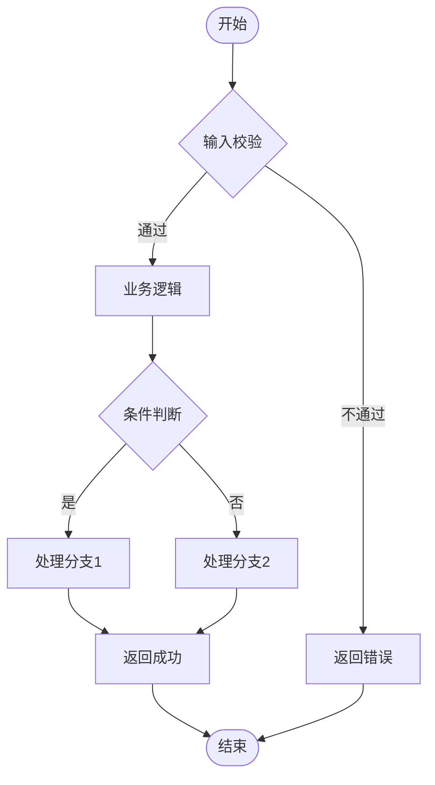

## 伪代码

```
FUNCTION function_name(params):
    # 1. 输入校验
    IF params invalid THEN
        RETURN Error("Invalid params")
    
    # 2. 业务逻辑
    IF condition THEN
        result = process_branch_1()
    ELSE
        result = process_branch_2()
    
    # 3. 返回结果
    RETURN Success(result)
```

````

#### Step 7.2: 设计类图

````markdown
# 类图 - [模块名称]

## 类图（Mermaid）

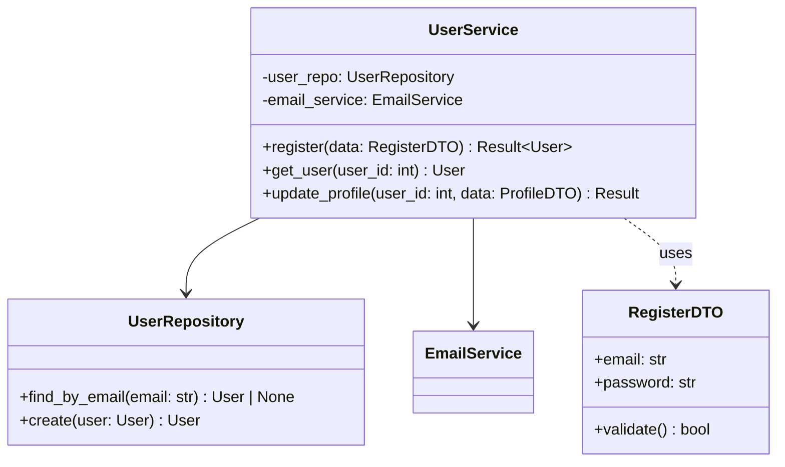
````

#### Step 7.3: 编写代码

```python
# 代码必须严格遵循流程图和类图

class UserService:
    def __init__(self, user_repo: UserRepository, email_service: EmailService):
        self.user_repo = user_repo
        self.email_service = email_service
    
    async def register(self, data: RegisterDTO) -> Result[User]:
        """
        注册新用户
        
        对应流程图: 函数流程图 - register
        对应类图: UserService.register()
        """
        # 步骤 1: 输入校验（流程图节点 B）
        if not data.validate():
            return Result.fail(Error.INVALID_PARAMS, "参数校验失败")
        
        # 步骤 2: 检查邮箱是否存在（流程图节点 C）
        existing_user = await self.user_repo.find_by_email(data.email)
        if existing_user:
            return Result.fail(Error.EMAIL_EXISTS, "邮箱已被注册")
        
        # 步骤 3: 创建用户（流程图节点 F/G）
        user = await self._create_user(data)
        
        # 步骤 4: 发送欢迎邮件（异步）
        await self.email_service.send_welcome(user.email)
        
        return Result.success(user)
```

#### Step 7.4: 编写单元测试

```python
import pytest
from unittest.mock import AsyncMock, Mock

@pytest.mark.asyncio
async def test_register_success():
    """测试注册成功场景
    对应 Gherkin Scenario: 正常注册
    对应测试用例: TEST-001
    """
    # Given
    user_repo = AsyncMock()
    email_service = AsyncMock()
    service = UserService(user_repo, email_service)
    data = RegisterDTO(email="test@example.com", password="password123")
    
    user_repo.find_by_email.return_value = None
    user_repo.create.return_value = User(id=1, email=data.email)
    
    # When
    result = await service.register(data)
    
    # Then
    assert result.is_success()
    assert result.data.email == data.email
    user_repo.create.assert_called_once()

@pytest.mark.asyncio
async def test_register_duplicate_email():
    """测试邮箱重复场景
    对应 Gherkin Scenario: 邮箱已存在
    对应测试用例: TEST-002
    """
    # Given
    user_repo = AsyncMock()
    email_service = AsyncMock()
    service = UserService(user_repo, email_service)
    data = RegisterDTO(email="existing@example.com", password="password123")
    
    user_repo.find_by_email.return_value = User(id=1, email=data.email)
    
    # When
    result = await service.register(data)
    
    # Then
    assert result.is_failure()
    assert result.error == Error.EMAIL_EXISTS
```

**质量检查**：

- [ ] 流程图已绘制并通过审核
- [ ] 类图已绘制并通过审核
- [ ] 代码严格遵循流程图/类图
- [ ] 单元测试已编写
- [ ] 所有单元测试通过
- [ ] 代码 ID 已关联任务 ID 和测试 ID

**门禁检查**：

```
Phase 7 完成！

📊 产出物：
- 流程图：已生成 ✓
- 类图：已生成 ✓
- 代码：已编写 ✓
- 单元测试：已编写并通过 ✓
- 函数数量：{count}
- 测试用例数：{count}
- 测试通过率：100%

⚠️ 如有测试未通过，必须先修复！

请确认：
1. 代码逻辑是否符合流程图？
2. 所有测试是否通过？
3. 可以进入阶段 8 吗？
```

**用户确认前不要继续！**

***

### Phase 8: 大逻辑集成 → 端到端验证

**产出**：端到端流程图、冒烟测试路径

**AI 约束**：

- 必须串联所有模块，验证完整业务流程
- 必须执行冒烟测试，验证核心路径可用
- **禁止跳过集成测试直接交付**

**详细步骤**：

#### Step 8.1: 设计端到端流程图

````markdown
# 端到端流程图 - [功能名称]

## 完整业务流程（Mermaid）

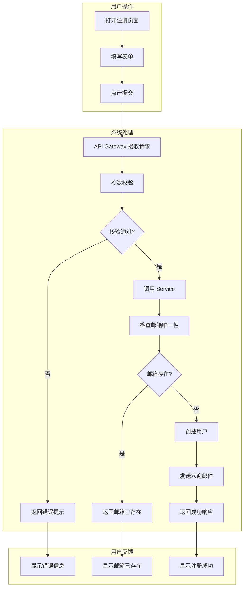

## 冒烟测试路径

### 正向路径（Happy Path）

| 步骤 | 操作     | 预期结果   | 实际结果   | 状态 |
| -- | ------ | ------ | ------ | -- |
| 1  | 打开注册页面 | 页面正常加载 | <br /> | ☐  |
| 2  | 填写有效信息 | 表单验证通过 | <br /> | ☐  |
| 3  | 点击提交   | 显示加载状态 | <br /> | ☐  |
| 4  | 等待响应   | 显示注册成功 | <br /> | ☐  |
| 5  | 检查邮箱   | 收到欢迎邮件 | <br /> | ☐  |

### 反向路径（Error Paths）

| 步骤 | 操作      | 预期结果     | 实际结果   | 状态 |
| -- | ------- | -------- | ------ | -- |
| 1  | 填写无效邮箱  | 显示格式错误   | <br /> | ☐  |
| 2  | 填写弱密码   | 显示密码强度不足 | <br /> | ☐  |
| 3  | 使用已注册邮箱 | 显示邮箱已存在  | <br /> | ☐  |

````

#### Step 8.2: 编写集成测试

````python
# tests/integration/test_user_register_e2e.py

import pytest
from httpx import ASGITransport, AsyncClient
from app.main import app

@pytest.mark.asyncio
async def test_register_complete_flow():
    """端到端测试：完整注册流程
    冒烟测试路径：正向路径
    """
    transport = ASGITransport(app=app)
    async with AsyncClient(transport=transport, base_url="http://test") as client:
        # Step 1: 提交注册请求
        response = await client.post("/api/users/register", json={
            "email": "e2e_test@example.com",
            "password": "SecurePass123!"
        })
        
        # Step 2: 验证响应
        assert response.status_code == 201
        data = response.json()
        assert data["code"] == "success"
        assert "user_id" in data["data"]
        
        # Step 3: 验证用户已创建
        user_response = await client.get(f"/api/users/{data['data']['user_id']}")
        assert user_response.status_code == 200

@pytest.mark.asyncio
async def test_register_duplicate_email_e2e():
    """端到端测试：邮箱重复
    冒烟测试路径：反向路径
    """
    transport = ASGITransport(app=app)
    async with AsyncClient(transport=transport, base_url="http://test") as client:
        # 第一次注册
        await client.post("/api/users/register", json={
            "email": "duplicate@example.com",
            "password": "SecurePass123!"
        })
        
        # 第二次注册（相同邮箱）
        response = await client.post("/api/users/register", json={
            "email": "duplicate@example.com",
            "password": "AnotherPass123!"
        })
        
        # 应该返回冲突
        assert response.status_code == 409
        assert response.json()["error_code"] == "EMAIL_EXISTS"
````

**质量检查**：

- [ ] 端到端流程图已绘制
- [ ] 冒烟测试路径已定义
- [ ] 正向路径测试通过
- [ ] 反向路径测试通过
- [ ] 所有模块已集成
- [ ] 集成测试 ID 已关联所有模块代码 ID

**门禁检查**：

```
Phase 8 完成！

📊 产出物：
- 端到端流程图：已生成 ✓
- 冒烟测试：已完成 ✓
- 集成测试：已编写并通过 ✓
- 正向路径：✓/{total}
- 反向路径：✓/{total}
- 集成测试覆盖率：100%

⚠️ 如有集成测试失败，必须先修复！

请确认：
1. 端到端流程是否通畅？
2. 所有冒烟测试是否通过？
3. 可以进入阶段 9 吗？
```

**用户确认前不要继续！**

***

### Phase 9: 用户验收 → 操作引导

**产出**：用户操作流程图、验收报告

**AI 约束**：

- 操作步骤必须清晰，引导用户手动验证
- 必须提供完整的验收检查清单
- **禁止在用户验收前宣布完成**

**详细步骤**：

#### Step 9.1: 生成用户操作指南

````markdown

# 用户操作指南 - [功能名称]

## 操作流程图（Mermaid）

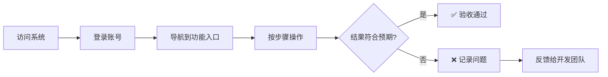

## 详细操作步骤

### 步骤 1：准备工作

**操作**:

1. 打开浏览器，访问系统地址：`https://your-system.com`
2. 使用管理员账号登录
3. 确认系统版本号：v{version}

**预期结果**:

- ✅ 系统正常加载
- ✅ 登录成功
- ✅ 版本号正确

**截图位置**: \[ ]

***

### 步骤 2：执行核心功能

**操作**:

1. 导航到菜单：\[菜单路径]
2. 点击按钮：\[按钮名称]
3. 填写表单：
   - 字段 1：\[值]
   - 字段 2：\[值]
4. 点击提交

**预期结果**:

- ✅ \[预期结果 1]
- ✅ \[预期结果 2]

**截图位置**: \[ ]

````

#### Step 9.2: 生成验收报告

````markdown

# 验收报告 - [功能名称]

## 基本信息

| 项目 | 内容 |
|------|------|
| 功能名称 | [名称] |
| 功能标识 | [feature-id] |
| 验收日期 | YYYY-MM-DD |
| 验收人 | [姓名] |
| 开发团队 | [团队] |

## 验收清单

### 功能完整性

| 序号 | 验收项 | 预期结果 | 实际结果 | 状态 | 备注 |
|-----|-------|---------|---------|------|------|
| 1 | [验收项] | [预期] | [实际] | ☐/☑ | |

### 性能指标

| 指标 | 目标值 | 实测值 | 状态 |
|-----|-------|-------|------|
| 响应时间 | < 500ms | {X}ms | ☐/☑ |
| 并发支持 | 100 QPS | {X} QPS | ☐/☑ |
| 错误率 | < 0.1% | {X}% | ☐/☑ |

### 问题记录

| 问题 ID | 问题描述 | 严重程度 | 发现时间 | 状态 |
|---------|---------|---------|---------|------|
| (如有) | | P0/P1/P2 | | 待修复/已修复 |

## 验收结论

□ 通过 - 所有验收项均满足要求
□ 有条件通过 - 存在非阻塞性问题
□ 不通过 - 存在阻塞性问题

**签字**: ________________ **日期**: ________________

````

**质量检查**：

- [ ] 用户操作指南清晰易懂
- [ ] 验收检查清单完整
- [ ] 所有关键功能已验证
- [ ] 性能指标达标
- [ ] 问题记录完整
- [ ] 验收报告已归档
- [ ] 最终追溯链已闭合

**门禁检查**：

```
Phase 9 完成！（最终阶段）

📊 产出物：
- 用户操作指南：已生成 ✓
- 验收报告：已生成 ✓
- 验收项通过率：{X}%
- 性能达标项：{X}/{Y}
- 问题数：{Z}

🎉 恭喜！如果验收通过，功能开发圆满完成！

请确认：
1. 功能是否符合预期？
2. 是否有问题需要修复？
3. 是否可以正式发布？
```

***

## ⚙️ 执行模式

### Mode A: 完整模式（Full Mode）

- **描述**: 执行完整的 10 阶段流水线
- **适用场景**: 新功能从零开始开发
- **预计耗时**: 取决于功能复杂度

```bash
aifirst-prd-manager full --feature=[feature-name]
```

### Mode B: 快速模式（Fast Mode）

- **描述**: 跳过部分文档，聚焦核心产出
- **适用场景**: 小功能、原型开发
- **注意**: 仍然遵循 10 阶段顺序，但简化部分产出

```bash
aifirst-prd-manager fast --feature=[feature-name]
```

### Mode C: 审计模式（Audit Mode）

- **描述**: 仅审查现有 PRD/代码的合规性
- **适用场景**: 代码审查、质量检查

```bash
aifirst-prd-manager audit --path=[project-path]
```

### Mode D: 修复模式（Fix Mode）

- **描述**: 从错误溯源开始，定位问题并修复
- **适用场景**: Bug 修复、问题排查

```bash
aifirst-prd-manager fix --trace-id=[trace-id]
```

***

## ✅ 质量门禁

### 流程约束（必须 100% 遵守）

- [x] **禁止**跳过任何开发阶段，必须严格按照 10 个阶段顺序执行
- [x] **禁止**在未完成上一阶段人工确认前，进入下一阶段
- [x] **禁止**修改已经人工确认过的规范/图表，除非走正式的变更流程
- [x] **禁止**在没有生成对应图表/规范前，直接生成代码

### 技术约束

- [x] **禁止**擅自引入 `project-constraint.yaml` 中未列出的依赖库/框架
- [x] **禁止**修改项目的基础架构、目录结构，除非有明确授权
- [x] **禁止**跨层调用，必须遵循模块职责定义
- [x] **禁止**在代码中硬编码敏感信息，必须使用配置文件
- [x] **🆕 禁止**在未通过 Phase 1.5 技术栈验证的情况下进行架构设计
- [x] **🆕 禁止**使用已 EOL 或已废弃的技术（参考 tech-stack-validation.md 黑名单）

### 行为约束

- [x] **禁止**臆造需求、臆造规则，所有实现必须严格匹配 PRD 中的规范
- [x] **禁止**删除、修改历史的追溯记录，所有变更必须留痕
- [x] **禁止**忽略校验清单中的检查项，完成任务后必须先自检
- [x] **禁止**生成没有测试用例的代码，所有代码必须有对应的单元测试

***

## 📚 相关资源

### 前置资源

- \[AI-First 强约束新式PRD模板]\(../Templates/AI-First 强约束新式PRD模板.md)
- [Google Skill 设计模式](../SkillsSuperTemplate.md)

### 参考资料

- [Mermaid 图表语法官方文档](https://mermaid.js.org/)
- [Gherkin 语法参考](https://cucumber.io/docs/gherkin-reference/)
- [约定式提交规范](https://www.conventionalcommits.org/)

***

**版本**: 1.1.0\
**创建日期**: 2026-04-02\
**最后更新**: 2026-04-03 (新增 Phase 1.5 技术栈验证阶段)\
**模式类型**: Pipeline + Inversion + Reviewer\
**核心理念**: 图表先行、逻辑后码、全链路可追溯、技术栈最新性验证\
**总阶段数**: 11 阶段（含 Phase 1.5）\
**状态**: 🟢 稳定
