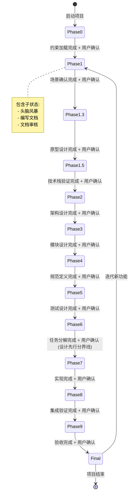

# AI-First PRD 管理器 v2.5 — 状态机解读

## 📊 状态机总览

本文档以状态机形式解读 `SKILL.md`，将 10 阶段流水线形式化为**有限状态自动机 (Finite State Machine)**，便于 AI 和人类理解执行流程。

```
┌─────────────────────────────────────────────────────────────────────┐
│                     AI-First PRD 状态机 v2.5                        │
│                                                                     │
│  初始状态 → [Phase 0] → [Phase 1] → [Phase 1.3] → [Phase 1.5] →   │
│                                                                     │
│  [Phase 2] → [Phase 3] → [Phase 4] → [Phase 5] → [Phase 6] →      │
│                        ↓ 设计先行分界线                              │
│  [Phase 7] → [Phase 8] → [Phase 9] → [最终交付] → (结束/迭代)      │
│                                                                     │
│  每个状态包含：编写前头脑风暴 → 编写 → 编写后审核 → 门禁检查        │
│  状态转移条件：用户确认 + 门禁检查通过                              │
└─────────────────────────────────────────────────────────────────────┘
```

---

## 🎯 状态机形式化定义

### 定义 1: 状态集合

```
S = {
  S₀: Phase 0 - 初始化与约束加载
  S₁: Phase 1 - 调研→场景确认
  S₁.₃: Phase 1.3 - 原型设计
  S₁.₅: Phase 1.5 - 技术栈验证
  S₂: Phase 2 - 架构设计
  S₃: Phase 3 - 模块设计
  S₄: Phase 4 - 规范定义
  S₅: Phase 5 - 测试设计
  S₆: Phase 6 - 任务分解
  S₇: Phase 7 - Subagent 驱动实现
  S₈: Phase 8 - 集成验证
  S₉: Phase 9 - 用户验收
  S_final: 最终交付
  S_end: 结束状态
}
```

### 定义 2: 输入字母表

```
Σ = {
  user_confirm: 用户确认进入下一阶段
  gate_pass: 门禁检查通过
  gate_fail: 门禁检查失败
  review_pass: 文档审核通过
  review_fail: 文档审核失败
  bug_found: 发现 Bug
  bug_fixed: Bug 已修复
  iteration_request: 请求迭代新功能
}
```

### 定义 3: 状态转移函数

```
δ: S × Σ → S

转移规则:
  δ(S₀, user_confirm) = S₁
  δ(S₁, user_confirm) = S₁.₃
  δ(S₁.₃, user_confirm) = S₁.₅
  δ(S₁.₅, user_confirm) = S₂
  δ(S₂, user_confirm) = S₃
  δ(S₃, user_confirm) = S₄
  δ(S₄, user_confirm) = S₅
  δ(S₅, user_confirm) = S₆
  δ(S₆, user_confirm) = S₇  (设计先行分界线)
  δ(S₇, user_confirm) = S₈
  δ(S₈, user_confirm) = S₉
  δ(S₉, user_confirm) = S_final
  δ(S_final, iteration_request) = S₁  (迭代循环)
  δ(S_final, user_confirm) = S_end
```

### 定义 4: 接受状态

```
F = {S_final, S_end}
```

---

## 🔄 详细状态转移图



---

## 📍 状态详细定义

### 状态 S₀: Phase 0 - 初始化与约束加载

**状态类型**: 初始准备状态

**进入条件**: 
- 启动新软件开发项目
- 创建新功能模块

**状态内活动**:
```
1. 加载全局约束
   - docs/project-constraint.yaml
   - references/constraint-checklist.md
   
2. 加载功能局部约束
   - feature-meta.md 元信息
   
3. 检查历史错误案例
   - resources/error_cases.md
```

**退出条件**: 
- ✅ 全局技术约束已加载并理解
- ✅ 项目禁止项已明确
- ✅ 历史错误案例已查阅
- ✅ 当前功能范围已确认

**转移目标**: S₁ (Phase 1)

**触发事件**: `user_confirm` (用户确认进入阶段 1)

---

### 状态 S₁: Phase 1 - 调研→场景确认

**状态类型**: 设计层 - 需求分析状态

**进入条件**: S₀ 完成 + 用户确认

**状态内子状态机**:
```
S₁.0: 头脑风暴 (编写前)
  ↓ (完成探索)
S₁.1: 需求收集 (Inversion 模式)
  ↓ (信息完整)
S₁.2: 生成用例图
  ↓ (用例完成)
S₁.3: 生成业务活动图
  ↓ (图表完成)
S₁.4: 文档审核 (编写后)
  ↓ (审核通过)
S₁.exit: 门禁检查
```

**子状态转移规则**:
```
δ(S₁.0, brainstorming_complete) = S₁.1
δ(S₁.1, info_complete) = S₁.2
δ(S₁.2, usecase_complete) = S₁.3
δ(S₁.3, activity_complete) = S₁.4
δ(S₁.4, review_pass) = S₁.exit
δ(S₁.4, review_fail) = S₁.2 (返工)
δ(S₁.exit, gate_pass) = S₁.₃ (Phase 1.3)
δ(S₁.exit, gate_fail) = S₁.0 (重新头脑风暴)
```

**产出物**:
- 01-usecase.md (用例图)
- 02-activity.md (业务活动图)
- 文档审核报告

**退出条件**: 
- 所有主流程已覆盖
- 分支场景已识别
- 异常情况已处理
- 用例 ID 已生成
- 追溯记录已更新
- **文档审核已通过**

**转移目标**: S₁.₃ (Phase 1.3)

---

### 状态 S₁.₃: Phase 1.3 - 原型设计 🆕

**状态类型**: 设计层 - 可视化设计状态

**进入条件**: S₁ 完成 + 用户确认

**状态内子状态机**:
```
S₁.₃.0: 头脑风暴 (原型规划)
  ↓ (规划完成)
S₁.₃.1: 线框图设计 (低保真)
  ↓ (线框图完成)
S₁.₃.2: 高保真原型设计
  ↓ (视觉设计完成)
S₁.₃.3: 可交互原型实现 (HTML/CSS)
  ↓ (原型实现完成)
S₁.₃.4: 原型审核 (编写后)
  ↓ (审核通过)
S₁.₃.exit: 门禁检查
```

**子状态转移规则**:
```
δ(S₁.₃.0, prototype_plan_complete) = S₁.₃.1
δ(S₁.₃.1, wireframe_complete) = S₁.₃.2
δ(S₁.₃.2, visual_design_complete) = S₁.₃.3
δ(S₁.₃.3, prototype_complete) = S₁.₃.4
δ(S₁.₃.4, review_pass) = S₁.₃.exit
δ(S₁.₃.4, review_fail) = S₁.₃.1 (返工)
δ(S₁.₃.exit, gate_pass) = S₁.₅ (Phase 1.5)
δ(S₁.₃.exit, gate_fail) = S₁.₃.0 (重新规划)
```

**产出物**:
- 线框图 (n 个页面)
- 高保真原型 (Figma/墨刀链接)
- 可交互原型 (HTML/CSS)
- UI 设计规范文档
- 原型审核报告

**退出条件**: 
- 线框图已完成
- 高保真原型已完成
- HTML/CSS原型（核心流程）已完成
- UI 设计规范已定义
- 原型审核已通过
- 阻塞项已全部修复

**转移目标**: S₁.₅ (Phase 1.5)

---

### 状态 S₁.₅: Phase 1.5 - 技术栈验证 🆕

**状态类型**: 设计层 - 技术验证状态

**进入条件**: S₁.₃ 完成 + 用户确认

**状态内活动**:
```
1. 6 维度技术栈验证框架
   - 社区活跃度
   - 版本发布节奏
   - 文档完整性
   - 生态工具链
   - 生产案例
   - 团队适配度
   
2. 生成验证报告
   - 推荐技术列表
   - 需要替换的技术
   - 替代方案建议
```

**退出条件**: 
- 技术验证报告完成
- 替代方案已确认
- 最终技术栈列表确定

**转移目标**: S₂ (Phase 2)

---

### 状态 S₂: Phase 2 - 架构设计→系统蓝图锁定

**状态类型**: 设计层 - 架构设计状态

**进入条件**: S₁.₅ 完成 + 用户确认

**状态内子状态机**:
```
S₂.0: 头脑风暴 (技术选型可行性)
  ↓ (探索完成)
S₂.0.5: 架构原则自检 (预防式)
  ↓ (边画边查)
S₂.1: 设计组件图 (子代理 A 并行)
  ↓ (组件图完成)
S₂.2: 设计部署拓扑 (子代理 B 并行)
  ↓ (部署图完成)
S₂.3: 文档审核 (编写后)
  ↓ (审核通过)
S₂.exit: 门禁检查
```

**并行执行**:
```
子代理 A: 设计组件图 (聚焦业务层分解)
子代理 B: 设计部署拓扑 (聚焦基础设施)
条件：两者无共享状态，可完全并行
约束：都必须遵循 project-constraint.yaml 中的技术栈
```

**退出条件**: 
- 组件图已完成并通过审核
- 部署图已完成并通过审核
- 技术栈验证通过
- 安全性/性能/量化指标已处理

**转移目标**: S₃ (Phase 3)

---

### 状态 S₃: Phase 3 - 模块设计→接口与数据锁定

**状态类型**: 设计层 - 详细设计状态

**进入条件**: S₂ 完成 + 用户确认

**状态内子状态机**:
```
S₃.0: 头脑风暴 (接口合理性)
  ↓ (探索完成)
S₃.0.5: 模块设计原则自检 (预防式)
  ↓ (边写边查)
S₃.1: 设计接口时序图 (子代理 A 并行)
  ↓ (时序图完成)
S₃.2: 设计数据库 ER 图 (子代理 B 并行)
  ↓ (ER 图完成)
S₃.3: 文档审核 (编写后)
  ↓ (审核通过)
S₃.exit: 门禁检查
```

**并行执行**:
```
子代理 A: 设计接口时序图 (API 层)
子代理 B: 设计数据库 ER 图 (数据层)
条件：API 定义和数据模型可独立设计
约束：时序图的每个箭头必须对应 ER 图的操作
```

**退出条件**: 
- 接口时序图已完成并通过审核
- ER 图已完成并通过审核
- 接口定义完整
- 数据模型符合需求
- 量化/索引/幂等性已处理

**转移目标**: S₄ (Phase 4)

---

### 状态 S₄: Phase 4 - 规范定义→可执行规则锁定

**状态类型**: 设计层 - 规范定义状态

**进入条件**: S₃ 完成 + 用户确认

**状态内子状态机**:
```
S₄.0: 头脑风暴 (状态机完备性)
  ↓ (探索完成)
S₄.0.5: 规范设计原则自检 (预防式)
  ↓ (边写边查)
S₄.1: 设计状态机图 (子代理 A 并行)
  ↓ (状态图完成)
S₄.2: 编写业务规则表 (子代理 B 并行)
  ↓ (规则表完成)
S₄.3: 编写 Gherkin 场景 (子代理 C 并行)
  ↓ (场景完成)
S₄.4: 文档审核 (编写后)
  ↓ (审核通过)
S₄.exit: 门禁检查
```

**并行执行**:
```
子代理 A: 设计状态机图
子代理 B: 编写业务规则表
子代理 C: 编写 Gherkin 场景
条件：三者基于相同的 Phase 1-3 设计产物，可并行
约束：Gherkin 场景必须能映射到规则表的规则 ID
```

**退出条件**: 
- 状态机图已完成并通过审核
- 业务规则表已完成并通过审核
- Gherkin 场景已完成并通过审核
- 状态完备性/可执行性已处理

**转移目标**: S₅ (Phase 5)

---

### 状态 S₅: Phase 5 - 测试设计→覆盖度验证

**状态类型**: 设计层 - 测试设计状态

**进入条件**: S₄ 完成 + 用户确认

**状态内子状态机**:
```
S₅.0: 头脑风暴 (边界用例/异常路径)
  ↓ (探索完成)
S₅.0.5: 测试神圣性原则 (预防式)
  ↓ (边写边查)
S₅.1: 生成测试用例矩阵
  ↓ (矩阵完成)
S₅.2: 生成规范 - 测试映射图
  ↓ (映射图完成)
S₅.3: 文档审核 (编写后)
  ↓ (审核通过)
S₅.exit: 门禁检查
```

**测试神圣性原则**:
```
每写一个测试用例时自检:
□ 这个测试场景来自 Phase 1 的哪个用例？(UC-ID)
□ 这个测试断言来自 Phase 4 的哪条规则？(R-ID) 或哪个 Gherkin 场景？
□ 如果这个测试失败了，我能确定是"实现错了"还是"测试写错了"吗？
□ 测试是否独立？
□ 测试名称是否清晰描述了业务意图？
```

**退出条件**: 
- 测试用例矩阵已生成并通过审核
- 规范 - 测试映射图已生成并通过审核
- 场景覆盖率 100%
- 负面测试/数据隔离已处理

**转移目标**: S₆ (Phase 6)

---

### 状态 S₆: Phase 6 - 任务分解→最小功能单元拆分

**状态类型**: 设计层 - 任务规划状态 (设计层最后状态)

**进入条件**: S₅ 完成 + 用户确认

**状态内子状态机**:
```
S₆.0: 提取功能点
  ↓ (功能点提取完成)
S₆.0.5: 文件授权清单 (边界约束原则)
  ↓ (授权清单完成)
S₆.1: 生成 PERT 图
  ↓ (PERT 图完成)
S₆.2: 生成任务清单 (细粒度)
  ↓ (任务清单完成)
S₆.3: 识别关键路径
  ↓ (路径识别完成)
S₆.4: 文档审核 (编写后)
  ↓ (审核通过)
S₆.exit: 门禁检查 (设计先行分界线)
```

**文件授权清单**:
```
每个任务的描述必须包含:
- 可修改文件清单 (明确授权)
- 参考文件清单 (只读权限)
- 禁止修改清单 (明确排除)
```

**退出条件**: 
- PERT 图已生成并通过审核
- 最小功能单元任务清单已生成并通过审核
- 任务拆分粒度合理
- 依赖关系正确
- 可验证性明确
- 无占位符
- 文件边界清晰

**转移目标**: S₇ (Phase 7) **← 设计先行分界线**

---

### 状态 S₇: Phase 7 - Subagent 驱动实现 → TDD + 双阶段审查

**状态类型**: 执行层 - 代码实现状态

**进入条件**: S₆ 完成 + 用户确认 **(设计先行分界线)**

**状态内子状态机**:
```
S₇.0: Git Worktree 隔离
  ↓ (工作区就绪)
S₇.0.5: 全量编码原则自检 (预防式)
  ↓ (边写边查)
S₇.0.6: 文件授权检查 (边界约束)
  ↓ (授权验证通过)
  
对于每个 Task T-[x]:
  S₇.1: 派遣 Implementer (TDD 红绿重构)
    ↓ (实现完成)
  S₇.2: Spec Reviewer (规范合规审查)
    ↓ (审查通过)
  S₇.3: Code Quality Reviewer (质量审查)
    ↓ (审查通过)
  S₇.4: 标记任务完成
  
S₇.5: Code Review (汇总审查)
  ↓ (审查通过)
S₇.6: 完成前验证 (证据优先)
  ↓ (验证通过)
S₇.exit: 门禁检查
```

**TDD 铁律**:
```
RED 阶段 → GREEN 阶段 → REFACTOR 阶段
  ↓           ↓            ↓
写失败测试   写最小代码   优化重构
```

**并行执行**:
```
对于无依赖的独立任务:
子代理 A → 数据层任务组
子代理 B → 服务层任务组
子代理 C → 工具层任务组
条件：任务间无共享状态，可完全并行
```

**退出条件**: 
- 所有任务已完成 (TDD 验证)
- 双阶段审查已完成 (Spec + Quality)
- Code Review 已通过
- 完成前验证已通过 (证据确凿)
- Lint 检测通过 (0 errors, 0 warnings)
- 类型检查通过
- 安全扫描通过
- MarkdownLint 通过
- 边界约束合规

**转移目标**: S₈ (Phase 8)

---

### 状态 S₈: Phase 8 - 大逻辑集成 → 端到端验证

**状态类型**: 执行层 - 集成验证状态

**进入条件**: S₇ 完成 + 用户确认

**状态内子状态机**:
```
S₈.1: 设计端到端流程图
  ↓ (流程图完成)
S₈.2: 编写集成测试
  ↓ (测试完成)
S₈.3: 集成审核 + Bug 处理
  ├─ 发现 Bug
  │   ├─ 需求/规范偏差 → Error Closed-Loop
  │   └─ 技术 Bug → Systematic Debugging (4 阶段)
  └─ Bug 修复 → 回归测试
  ↓ (Bug 闭环)
S₈.4: Code Review (集成级)
  ↓ (审查通过)
S₈.exit: 门禁检查
```

**Bug 处理双引擎**:
```
发现 Bug
  │
  ├─ 是需求/规范偏差？
  │   └─ 引擎 A: Error Closed-Loop
  │       Reproduce → Trace → Classify → Fix → Update Constraints
  │
  └─ 是技术 Bug？
      └─ 引擎 B: Systematic Debugging
          Phase 1: 根因调查
          Phase 2: 模式分析
          Phase 3: 假设测试
          Phase 4: 实施修复
              └─ ≥3 次失败 → 触发架构质疑
```

**退出条件**: 
- 端到端流程图已生成
- 集成测试已编写并通过
- 冒烟测试通过率 100%
- 集成级 Code Review 已通过
- Bug 已全部闭环

**转移目标**: S₉ (Phase 9)

---

### 状态 S₉: Phase 9 - 用户验收 → 操作引导 + 分支收尾

**状态类型**: 执行层 - 验收收尾状态

**进入条件**: S₈ 完成 + 用户确认

**状态内子状态机**:
```
S₉.1: 编写操作手册
  ↓ (手册完成)
S₉.2: 生成上线检查清单
  ↓ (清单完成)
S₉.3: 分支收尾
  ├─ 验证测试通过
  ├─ 确定基础分支
  ├─ 呈现 4 选项
  │   1. Merge back to base branch
  │   2. Push and create Pull Request
  │   3. Keep the branch as-is
  │   └─ 4. Discard this work
  └─ 执行选择 + 清理 Worktree
  ↓ (收尾完成)
S₉.4: 验收审核
  ↓ (审核通过)
S₉.exit: 门禁检查
```

**退出条件**: 
- 操作手册已生成并通过审核
- 上线检查清单已生成并通过审核
- 验收报告已生成
- 分支处理已完成 (Option 1/2/3/4)
- Worktree 已清理

**转移目标**: S_final (最终交付)

---

### 状态 S_final: 最终交付

**状态类型**: 接受状态

**进入条件**: S₉ 完成 + 用户确认

**产出物清单**:
```
设计层产出 (Phase 0-6):
├── 01-usecase.md ~ 09-gherkin.md (9 份设计文档 + 审核)
├── tech-stack-validation-report.md
├── task-checklist.md + PERT 图
└── 全部文档审核记录

执行层产出 (Phase 7-9):
├── 实现代码 (TDD 红绿重构保障)
├── 单元测试 (100% 通过)
├── 集成测试 (E2E 冒烟通过)
├── 双阶段审查记录 (Spec + Quality)
├── Code Review 记录
├── 操作手册 + 上线检查清单
└── 验收报告

贯穿层产出:
├── 全链路追溯记录 (UC→CODE)
├── Git Worktree 清理记录
├── Bug 闭环记录 (如有的话)
└── constraint.yaml 更新记录
```

**转移规则**:
```
δ(S_final, iteration_request) = S₁ (迭代新功能)
δ(S_final, user_confirm) = S_end (项目结束)
```

---

### 状态 S_end: 结束状态

**状态类型**: 终止状态

**进入条件**: S_final 完成 + 用户确认 (不迭代)

**退出条件**: 无 (终止状态)

---

## 🚦 门禁检查机制

### 门禁检查形式化

每个状态 Sᵢ 都有关联的门禁检查函数:

```
Gateᵢ: State → {PASS, CONDITIONAL_PASS, FAIL}

Gateᵢ(s) = 
  PASS              if all_checks_passed(s)
  CONDITIONAL_PASS  if minor_issues_exist(s) ∧ fix_plan_defined(s)
  FAIL              if critical_issues_exist(s)
```

### 门禁检查表

| 状态 | 门禁检查项 | 通过条件 |
|------|----------|---------|
| S₀ | 约束加载确认 | 3 项全部确认 |
| S₁ | 场景完整性 | 4 项确认 + 审核通过 |
| S₁.₃ | 原型设计确认 | 4 项确认 + 审核通过 |
| S₁.₅ | 技术栈验证 | 4 项确认 |
| S₂ | 架构设计确认 | 4 项确认 + 审核通过 |
| S₃ | 模块设计确认 | 4 项确认 + 审核通过 |
| S₄ | 规范定义确认 | 4 项确认 + 审核通过 |
| S₅ | 测试设计确认 | 4 项确认 + 审核通过 |
| S₆ | 任务分解确认 | 4 项确认 + 审核通过 |
| S₇ | 实现完成确认 | 4 项确认 + 全量验证通过 |
| S₈ | 集成验证确认 | 4 项确认 + Bug 闭环 |
| S₉ | 验收完成确认 | 4 项确认 + 分支处理 |

---

## 🔁 迭代循环

### 迭代触发条件

```
当处于 S_final 状态时:
  - 用户提出新功能需求 → δ(S_final, iteration_request) = S₁
  - 用户确认项目结束 → δ(S_final, user_confirm) = S_end
```

### 迭代路径

```
S_final → S₁ → S₁.₃ → S₁.₅ → S₂ → S₃ → S₄ → S₅ → S₆ → S₇ → S₈ → S₉ → S_final
          ↑___________________________________________________________________|
                                    迭代循环
```

---

## 🎯 状态机执行示例

### 示例 1: 标准执行路径

```
[*] → S₀ → S₁ → S₁.₃ → S₁.₅ → S₂ → S₃ → S₄ → S₅ → S₆ → S₇ → S₈ → S₉ → S_final → [*]
```

### 示例 2: 审核返工路径

```
S₁ → S₁.0(头脑风暴) → S₁.1 → S₁.2 → S₁.3 → S₁.4(审核) 
   → review_fail → S₁.2(返工) → S₁.3 → S₁.4(审核) 
   → review_pass → S₁.exit → S₁.₃
```

### 示例 3: Bug 处理路径

```
S₈ → S₈.3(集成审核) → bug_found → Systematic Debugging
   → Phase 1(根因) → Phase 2(模式) → Phase 3(假设) → Phase 4(修复)
   → bug_fixed → 回归测试 → S₈.4 → S₈.exit → S₉
```

### 示例 4: 迭代路径

```
S_final → iteration_request → S₁(新功能) → ... → S_final → user_confirm → [*]
```

---

## 📊 状态复杂度分析

### 状态数量统计

```
总状态数：13 个主状态
  - 设计层状态：8 个 (S₀, S₁, S₁.₃, S₁.₅, S₂, S₃, S₄, S₅, S₆)
  - 执行层状态：3 个 (S₇, S₈, S₉)
  - 接受状态：2 个 (S_final, S_end)

子状态总数：40+ 个
  - 每个主状态平均包含 3-5 个子状态
  - S₇(实现阶段) 包含最多子状态 (Per-Task 循环)
```

### 转移路径统计

```
总转移边数：50+ 条
  - 正常转移：13 条
  - 返工转移：10+ 条 (审核失败/门禁失败)
  - 并行转移：15+ 条 (子代理并行)
  - 迭代转移：2 条
  - Bug 处理转移：10+ 条
```

---

## 🎨 可视化状态机

```
┌──────────────────────────────────────────────────────────────────────────┐
│                         AI-First PRD 状态机执行流程                       │
└──────────────────────────────────────────────────────────────────────────┘

[初始状态]
    │
    ▼
┌──────────────────────────────────────────────────────────────────────────┐
│  LAYER 1: 设计层 (Design Layer) - 线性强制顺序                           │
├──────────────────────────────────────────────────────────────────────────┤
│                                                                          │
│  ┌─────────┐   ┌─────────┐   ┌─────────┐   ┌─────────┐                 │
│  │ Phase 0 │ → │ Phase 1 │ → │Phase 1.3│ → │Phase 1.5│                 │
│  │ 初始化  │   │ 场景确认│   │原型设计 │   │技术验证 │                 │
│  └─────────┘   └─────────┘   └─────────┘   └─────────┘                 │
│       │             │             │             │                        │
│       ▼             ▼             ▼             ▼                        │
│  约束加载     用例图 +        线框图 +       6 维度验证                   │
│  完成确认     活动图          高保真原型     报告确认                     │
│                                                                          │
│  ┌─────────┐   ┌─────────┐   ┌─────────┐   ┌─────────┐                 │
│  │ Phase 2 │ → │ Phase 3 │ → │ Phase 4 │ → │ Phase 5 │                 │
│  │ 架构设计│   │模块设计 │   │规范定义 │   │测试设计 │                 │
│  └─────────┘   └─────────┘   └─────────┘   └─────────┘                 │
│       │             │             │             │                        │
│       ▼             ▼             ▼             ▼                        │
│  组件图 +      时序图 +        状态机 +       测试矩阵 +                  │
│  部署图        ER 图           规则表         映射图                      │
│                                                                          │
│  ┌─────────┐                                                            │
│  │ Phase 6 │ ←──────────── 设计先行分界线 ────────────                  │
│  │ 任务分解│                                                            │
│  └─────────┘                                                            │
│       │                                                                 │
│       ▼                                                                 │
├──────────────────────────────────────────────────────────────────────────┤
│  LAYER 2: 执行层 (Execution Layer) - 线性主流程 + 状态内并行             │
├──────────────────────────────────────────────────────────────────────────┤
│                                                                          │
│  ┌─────────┐   ┌─────────┐   ┌─────────┐                               │
│  │ Phase 7 │ → │ Phase 8 │ → │ Phase 9 │                               │
│  │Subagent │   │集成验证 │   │用户验收 │                               │
│  │ 实现    │   │         │   │         │                               │
│  └─────────┘   └─────────┘   └─────────┘                               │
│       │             │             │                                     │
│       ▼             ▼             ▼                                     │
│  TDD+ 双审查    端到端测试    操作手册 +                                 │
│  Lint Gate     Bug 闭环      分支收尾                                   │
│                                                                          │
├──────────────────────────────────────────────────────────────────────────┤
│  LAYER 3: 贯穿层 (Cross-Cutting Layer)                                   │
├──────────────────────────────────────────────────────────────────────────┤
│  🔗 全链路追溯 (UC→CODE) + Git Blame                                     │
│  🛡️ 双引擎错误处理 (Closed-Loop + Systematic 4 阶段)                     │
│  📊 双轨测试策略 (测试矩阵 + TDD 红绿循环)                                │
│  🔄 迭代循环 (Phase 9 完成后可回到 Phase 1)                               │
└──────────────────────────────────────────────────────────────────────────┘
    │
    ▼
┌─────────────────┐
│   最终交付      │
│   S_final      │ → [迭代] → Phase 1
│                 │ → [结束] → [*]
└─────────────────┘
```

---

## 🎓 状态机使用指南

### 如何使用此状态机

1. **确定当前状态**: 
   - 查看项目进度，确定当前处于哪个 Phase
   - 对照状态定义，确认当前状态的进入条件是否满足

2. **执行状态内活动**:
   - 按照状态内子状态机顺序执行
   - 每个子状态完成后检查转移条件

3. **通过门禁检查**:
   - 完成状态内所有活动后，执行门禁检查
   - 确保所有检查项通过或条件性通过

4. **状态转移**:
   - 获得用户确认后，转移到下一状态
   - 如遇返工 (审核失败)，返回相应子状态重新执行

5. **处理异常**:
   - Bug 发现时，进入 Bug 处理子状态机
   - Bug 闭环后，继续原状态流程

### 状态机优势

- ✅ **清晰可见**: 每个状态职责明确，产出物清晰
- ✅ **可追溯**: 状态转移有明确条件和事件
- ✅ **可验证**: 每个状态都有门禁检查
- ✅ **可迭代**: 支持从最终状态回到初始状态的迭代循环
- ✅ **可并行**: 状态内支持子代理并行执行
- ✅ **容错性**: 支持审核返工和 Bug 处理路径

---

## 📝 总结

本状态机文档将 AI-First PRD 管理器 v2.5 的 10 阶段流水线形式化为有限状态自动机，提供了:

1. **形式化定义**: 状态集合、输入字母表、转移函数、接受状态
2. **详细状态说明**: 13 个主状态 + 40+ 个子状态的完整定义
3. **转移规则**: 正常路径、返工路径、Bug 处理路径、迭代路径
4. **门禁机制**: 每个状态的进入/退出条件检查
5. **可视化**: 多种形式的状态机可视化图表

通过状态机形式，AI 和人类可以更清晰地理解执行流程，确保不跳步、不遗漏、高质量交付。

---

**版本**: 1.0.0 (状态机解读版)  
**创建日期**: 2026-04-07  
**参考文档**: `SKILL.md` (v2.5.0)  
**状态**: 🟢 稳定
