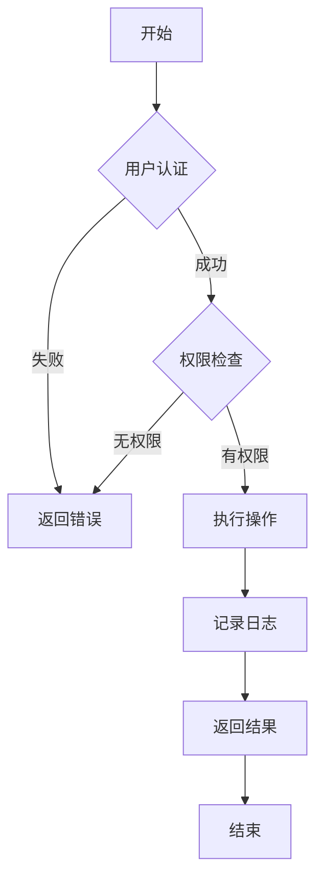
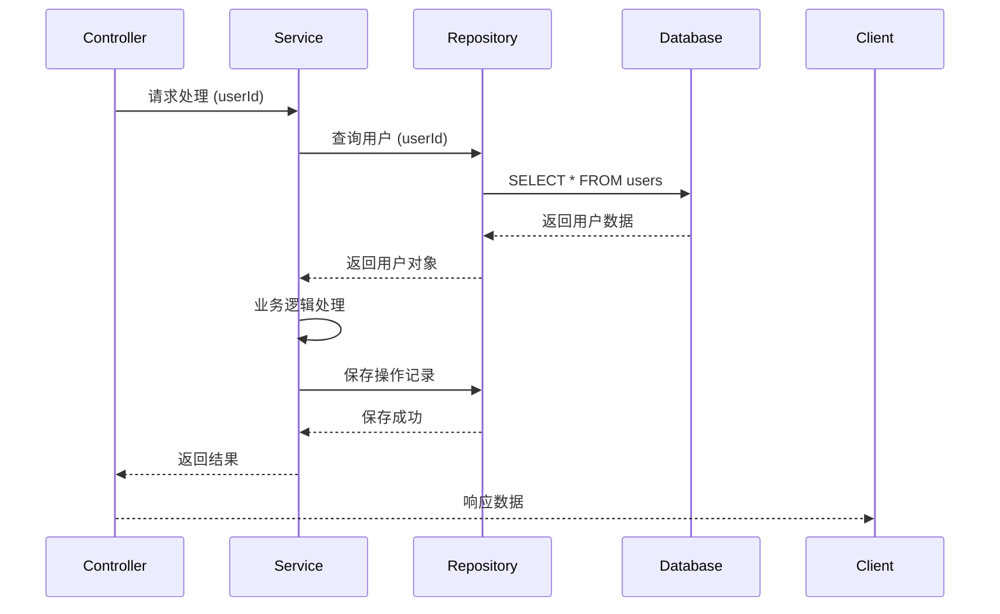
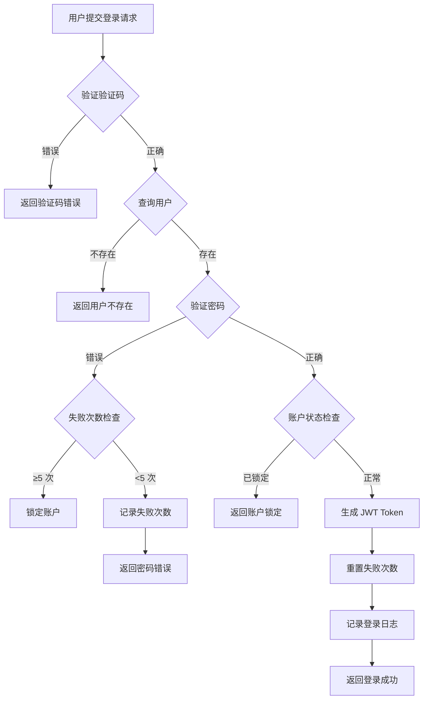
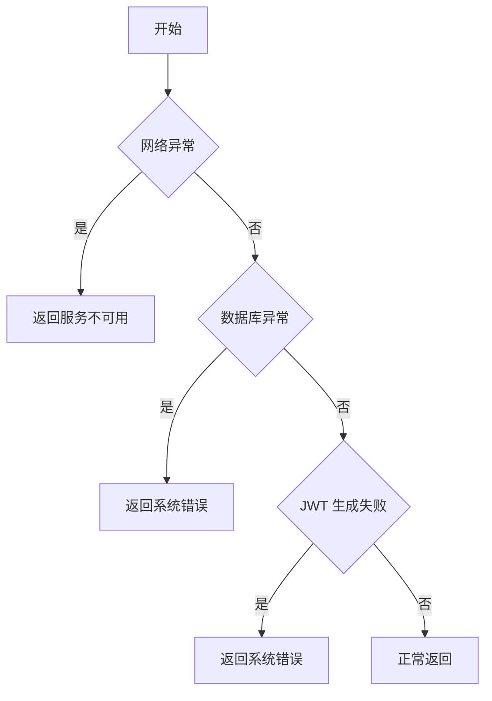
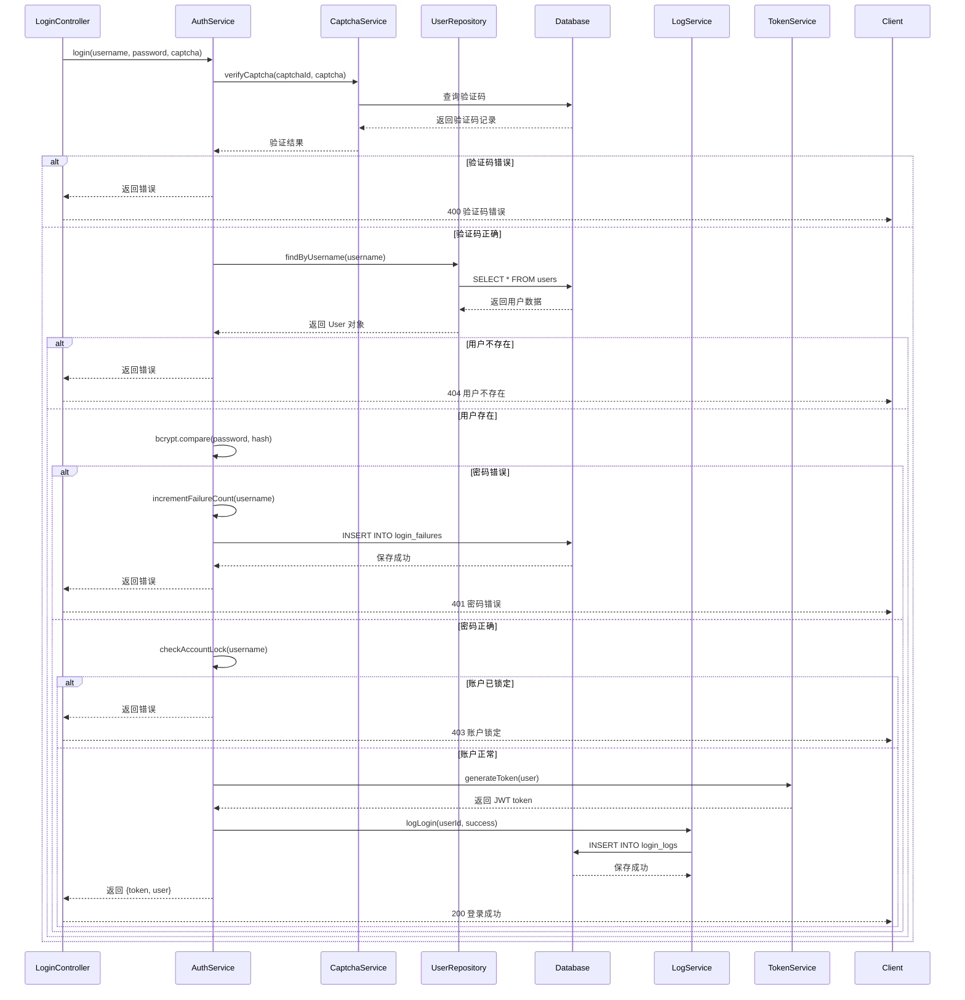

# 功能逻辑解析专家 (Function Logic Analyzer)

## 📋 技能概述

本技能用于在功能开发完成后，创建详细的功能逻辑解析文档。通过**图、表、文字**三种形式的混合呈现，确保功能的实现逻辑清晰、可追溯、易维护。

## 🎯 适用场景

- ✅ **功能开发完成后** - 必须调用此技能创建逻辑解析文档
- ✅ **复杂业务逻辑实现后** - 需要可视化展示逻辑流程
- ✅ **模块重构完成后** - 需要更新逻辑解析文档
- ✅ **代码审查前** - 提供逻辑解析辅助审查
- ✅ **知识传承** - 便于后续维护人员理解

## 🚫 禁止行为

- ❌ 功能实现后不调用此技能
- ❌ 仅用文字描述，没有图表
- ❌ 图表与代码实现不一致
- ❌ 逻辑解析文档过于简单

## 📊 文档要求

### 必须包含的内容（4 要素）

#### 1. 流程图（Flow Chart）⭐

**要求**：
- 使用 Mermaid 语法绘制流程图
- 展示完整的业务逻辑流程
- 包含所有分支和异常处理
- 标注关键决策点

**示例**：


#### 2. 数据表（Data Table）⭐

**要求**：
- 列出所有输入参数及其说明
- 列出所有输出结果及其说明
- 列出涉及的数据库表
- 列出关键变量和状态

**示例**：

**输入参数表**：
| 参数名 | 类型 | 必填 | 默认值 | 说明 |
|--------|------|------|--------|------|
| userId | string | 是 | - | 用户 ID |
| action | string | 是 | - | 操作类型 |
| options | object | 否 | {} | 配置选项 |

**输出结果表**：
| 字段名 | 类型 | 说明 |
|--------|------|------|
| success | boolean | 是否成功 |
| data | any | 返回数据 |
| error | string | 错误信息 |

**涉及数据表**：
| 表名 | 操作类型 | 说明 |
|------|---------|------|
| users | SELECT | 查询用户信息 |
| user_actions | INSERT | 记录用户操作 |
| logs | INSERT | 记录系统日志 |

#### 3. 时序图（Sequence Diagram）⭐

**要求**：
- 展示模块间的调用时序
- 标注所有重要的消息传递
- 包含同步和异步调用
- 展示错误处理流程

**示例**：


#### 4. 文字说明（Text Description）⭐

**要求**：
- 分步骤详细描述实现逻辑
- 解释关键决策的原因
- 说明异常处理机制
- 列出设计决策和权衡

**结构**：
```markdown
### 实现逻辑

#### 步骤 1：[步骤名称]
[详细描述]

#### 步骤 2：[步骤名称]
[详细描述]

...

### 关键决策

1. **决策点 1**：[描述]
   - 选择方案：[方案]
   - 原因：[原因]
   - 替代方案：[替代方案]

2. **决策点 2**：[描述]
   ...

### 异常处理

| 异常类型 | 触发条件 | 处理方式 | 用户提示 |
|---------|---------|---------|---------|
| [异常 1] | [条件] | [方式] | [提示] |
| [异常 2] | [条件] | [方式] | [提示] |

### 性能优化

- [优化点 1]：[描述]
- [优化点 2]：[描述]

### 安全考虑

- [安全点 1]：[描述]
- [安全点 2]：[描述]
```

## 📝 文档模板

### 功能逻辑解析文档模板

```markdown
# 功能逻辑解析 - [功能名称]

## 基本信息

| 项目 | 内容 |
|------|------|
| 功能名称 | [名称] |
| 实现日期 | [日期] |
| 开发者 | [姓名] |
| 版本号 | [版本] |
| 相关代码 | [文件路径] |

## 功能概述

### 业务背景
[为什么需要这个功能]

### 实现目标
[功能要解决什么问题]

### 核心职责
[功能的主要职责]

---

## 1. 流程图

### 主流程
```mermaid
[主流程图]
```

### 异常处理流程
```mermaid
[异常流程图]
```

---

## 2. 数据表

### 输入参数
| 参数名 | 类型 | 必填 | 默认值 | 说明 | 验证规则 |
|--------|------|------|--------|------|---------|
| | | | | | |

### 输出结果
| 字段名 | 类型 | 说明 | 示例 |
|--------|------|------|------|
| | | | |

### 涉及的数据表
| 表名 | 操作类型 | 数据量 | 索引 | 说明 |
|------|---------|--------|------|------|
| | | | | |

### 关键变量
| 变量名 | 类型 | 作用域 | 生命周期 | 说明 |
|--------|------|--------|---------|------|
| | | | | |

### 状态转换
| 状态 | 触发条件 | 下一状态 | 动作 |
|------|---------|---------|------|
| | | | |

---

## 3. 时序图

### 模块调用时序
```mermaid
[时序图]
```

### 异步处理时序（如有）
```mermaid
[异步时序图]
```

---

## 4. 文字说明

### 实现逻辑详解

#### 步骤 1：[步骤名称]
**职责**：[该步骤的职责]

**实现细节**：
```typescript
[关键代码片段]
```

**逻辑说明**：
[详细说明该步骤的逻辑]

**数据流转**：
- 输入：[输入数据]
- 处理：[处理方式]
- 输出：[输出数据]

#### 步骤 2：[步骤名称]
[同上结构]

...

### 关键决策

#### 决策点 1：[决策名称]

**问题**：[需要决策的问题]

**可选方案**：
1. **方案 A**：[描述]
   - 优点：[优点]
   - 缺点：[缺点]

2. **方案 B**：[描述]
   - 优点：[优点]
   - 缺点：[缺点]

**最终选择**：[方案 X]

**选择原因**：
- [原因 1]
- [原因 2]
- [原因 3]

**影响**：
- 正面影响：[影响]
- 负面影响：[影响及缓解措施]

### 异常处理机制

#### 异常分类

| 异常类型 | 严重程度 | 触发条件 | 处理策略 |
|---------|---------|---------|---------|
| 网络异常 | 高 | API 调用失败 | 重试 + 降级 |
| 数据异常 | 中 | 数据格式错误 | 返回错误 |
| 业务异常 | 中 | 业务规则违反 | 提示用户 |
| 系统异常 | 高 | 系统资源不足 | 告警 + 降级 |

#### 异常处理流程
```mermaid
[异常处理流程图]
```

#### 具体异常处理

**异常 1：[异常名称]**
- **触发条件**：[条件]
- **捕获位置**：[代码位置]
- **处理方式**：[方式]
- **日志记录**：[日志内容]
- **用户提示**：[提示信息]
- **恢复策略**：[策略]

...

### 性能优化

#### 优化点 1：[优化名称]

**问题**：[性能问题描述]

**优化方案**：[方案描述]

**优化效果**：
| 指标 | 优化前 | 优化后 | 提升 |
|------|--------|--------|------|
| 响应时间 | 500ms | 100ms | 80% |
| 吞吐量 | 100 QPS | 500 QPS | 400% |

#### 优化点 2：[优化名称]
[同上结构]

### 安全考虑

#### 安全点 1：[安全名称]

**风险**：[安全风险描述]

**防护措施**：
- [措施 1]
- [措施 2]

**验证方式**：[如何验证防护有效]

...

### 测试覆盖

#### 单元测试
- [ ] 正常场景测试
- [ ] 边界条件测试
- [ ] 异常场景测试

#### 集成测试
- [ ] 模块间接口测试
- [ ] 数据流转测试

#### 测试覆盖率
- 行覆盖率：[X]%
- 分支覆盖率：[X]%
- 函数覆盖率：[X]%

---

## 5. 附录

### 相关文档
- [需求文档链接]
- [设计文档链接]
- [API 文档链接]

### 相关代码
- [源代码链接]
- [测试代码链接]

### 参考资料
- [参考资料 1]
- [参考资料 2]

---

## 检查清单

- [ ] 流程图完整且正确
- [ ] 数据表完整且准确
- [ ] 时序图清晰展示调用关系
- [ ] 文字说明详细易懂
- [ ] 关键决策已记录
- [ ] 异常处理已说明
- [ ] 性能优化已记录
- [ ] 安全考虑已说明
- [ ] 测试覆盖已验证

---

**版本**: v1.0.0  
**最后更新**: [日期]  
**维护者**: [姓名]
```

## 🎯 使用示例

### 示例：用户登录功能逻辑解析

```markdown
# 功能逻辑解析 - 用户登录

## 基本信息

| 项目 | 内容 |
|------|------|
| 功能名称 | 用户登录 |
| 实现日期 | 2026-03-27 |
| 开发者 | 张三 |
| 版本号 | v1.0.0 |
| 相关代码 | `src/services/auth.service.ts` |

## 功能概述

### 业务背景
用户需要安全的登录功能，支持用户名密码认证和验证码登录。

### 实现目标
1. 验证用户凭据
2. 生成 JWT token
3. 防止暴力破解
4. 记录登录日志

---

## 1. 流程图

### 主流程


### 异常处理流程


---

## 2. 数据表

### 输入参数
| 参数名 | 类型 | 必填 | 默认值 | 说明 | 验证规则 |
|--------|------|------|--------|------|---------|
| username | string | 是 | - | 用户名 | 3-20 字符，字母数字 |
| password | string | 是 | - | 密码 | 6-32 字符 |
| captcha | string | 是 | - | 验证码 | 4 位数字 |
| captchaId | string | 是 | - | 验证码 ID | UUID 格式 |
| rememberMe | boolean | 否 | false | 是否记住我 | - |

### 输出结果
| 字段名 | 类型 | 说明 | 示例 |
|--------|------|------|------|
| success | boolean | 是否成功 | true |
| code | number | 状态码 | 200 |
| message | string | 消息 | 登录成功 |
| data.token | string | JWT token | eyJhbG... |
| data.user | object | 用户信息 | {...} |
| data.expiresIn | number | 过期时间（秒） | 7200 |

### 涉及的数据表
| 表名 | 操作类型 | 数据量 | 索引 | 说明 |
|------|---------|--------|------|------|
| users | SELECT | ~10 万 | username(UK) | 查询用户信息 |
| login_failures | SELECT/INSERT | ~1 万 | username(idx) | 记录登录失败 |
| login_logs | INSERT | ~100 万 | user_id(idx) | 记录登录日志 |
| user_captchas | SELECT/DELETE | ~1 万 | captcha_id(UK) | 验证验证码 |

### 关键变量
| 变量名 | 类型 | 作用域 | 生命周期 | 说明 |
|--------|------|--------|---------|------|
| failureCount | number | 函数内 | 临时 | 登录失败次数 |
| lockThreshold | number | 常量 | 永久 | 锁定阈值（5 次） |
| tokenExpiresIn | number | 配置 | 永久 | Token 过期时间 |
| maxAge | number | 配置 | 永久 | RememberMe 过期时间 |

### 状态转换
| 状态 | 触发条件 | 下一状态 | 动作 |
|------|---------|---------|------|
| 未登录 | 提交登录请求 | 验证中 | 调用验证服务 |
| 验证中 | 验证码正确 | 验证密码 | 查询用户 |
| 验证中 | 验证码错误 | 登录失败 | 返回错误 |
| 验证密码 | 密码正确 | 生成 Token | 创建会话 |
| 验证密码 | 密码错误 | 记录失败 | 失败计数 +1 |
| 记录失败 | 失败≥5 次 | 账户锁定 | 锁定账户 |
| 生成 Token | Token 生成成功 | 登录成功 | 返回结果 |

---

## 3. 时序图

### 模块调用时序


---

## 4. 文字说明

### 实现逻辑详解

#### 步骤 1：验证码验证

**职责**：验证用户输入的验证码是否正确

**实现细节**：
```typescript
async function login(dto: LoginDTO): Promise<LoginResult> {
  // 验证验证码
  const captchaValid = await this.captchaService.verify(
    dto.captchaId,
    dto.captcha
  );
  
  if (!captchaValid) {
    throw new ValidationException('验证码错误');
  }
}
```

**逻辑说明**：
1. 从数据库查询验证码记录
2. 比对验证码值和过期时间
3. 验证成功后删除验证码记录（一次性使用）
4. 验证失败直接抛出异常

**数据流转**：
- 输入：captchaId, captcha
- 处理：查询数据库 → 比对值 → 检查过期
- 输出：boolean（验证结果）

#### 步骤 2：用户查询

**职责**：根据用户名查询用户信息

**实现细节**：
```typescript
const user = await this.userRepository.findByUsername(dto.username);

if (!user) {
  // 统一错误信息，防止用户名枚举
  throw new AuthenticationException('用户名或密码错误');
}
```

**逻辑说明**：
1. 使用用户名查询用户
2. 用户不存在时，返回模糊错误信息
3. 防止攻击者通过错误信息枚举用户名

#### 步骤 3：密码验证

**职责**：验证用户密码是否正确

**实现细节**：
```typescript
const passwordMatches = await bcrypt.compare(dto.password, user.passwordHash);

if (!passwordMatches) {
  // 记录失败次数
  await this.recordLoginFailure(user.username);
  throw new AuthenticationException('用户名或密码错误');
}
```

**逻辑说明**：
1. 使用 bcrypt 比较密码和哈希值
2. 密码错误时记录失败次数
3. 返回统一错误信息

#### 步骤 4：账户锁定检查

**职责**：检查账户是否因多次失败被锁定

**实现细节**：
```typescript
const failureCount = await this.getLoginFailureCount(user.username);

if (failureCount >= 5) {
  await this.lockAccount(user.username);
  throw new AccountLockedException('账户已锁定，请 30 分钟后再试');
}
```

**逻辑说明**：
1. 查询登录失败次数
2. 达到阈值（5 次）则锁定账户
3. 锁定时间 30 分钟

#### 步骤 5：Token 生成

**职责**：生成 JWT token

**实现细节**：
```typescript
const tokenPayload = {
  sub: user.id,
  username: user.username,
  role: user.role,
};

const expiresIn = dto.rememberMe ? '7d' : '2h';

const token = await this.jwtService.sign(tokenPayload, {
  expiresIn,
});
```

**逻辑说明**：
1. 构建 token payload，包含用户 ID、用户名、角色
2. 根据 rememberMe 参数设置过期时间
3. 使用 HS256 算法签名

#### 步骤 6：日志记录

**职责**：记录登录日志用于审计

**实现细节**：
```typescript
await this.loginLogService.create({
  userId: user.id,
  username: user.username,
  loginTime: new Date(),
  ipAddress: request.ip,
  userAgent: request.headers['user-agent'],
  success: true,
});
```

**逻辑说明**：
1. 记录用户 ID、登录时间
2. 记录 IP 地址和 User-Agent
3. 记录登录结果（成功/失败）

### 关键决策

#### 决策点 1：密码错误信息

**问题**：密码错误时应该返回什么错误信息？

**可选方案**：
1. **方案 A**：明确提示"密码错误"
   - 优点：用户体验好
   - 缺点：暴露用户名存在性

2. **方案 B**：模糊提示"用户名或密码错误"
   - 优点：防止用户名枚举
   - 缺点：真实用户可能困惑

**最终选择**：方案 B

**选择原因**：
- 安全性优先，防止攻击者枚举用户名
- 虽然牺牲部分用户体验，但更安全
- 配合账户锁定机制，可防止暴力破解

#### 决策点 2：验证码时机

**问题**：验证码应该在什么时候验证？

**可选方案**：
1. **方案 A**：密码验证后验证验证码
   - 优点：减少验证码服务器压力
   - 缺点：无法防止密码暴力破解

2. **方案 B**：密码验证前验证验证码
   - 优点：有效防止暴力破解
   - 缺点：增加验证码服务器压力

**最终选择**：方案 B

**选择原因**：
- 安全性优先
- 在查询数据库前拦截恶意请求
- 保护后端服务

### 异常处理机制

#### 异常分类

| 异常类型 | 严重程度 | 触发条件 | 处理策略 |
|---------|---------|---------|---------|
| ValidationException | 低 | 参数验证失败 | 返回 400 |
| AuthenticationException | 中 | 认证失败 | 返回 401 |
| AccountLockedException | 中 | 账户被锁定 | 返回 403 |
| DatabaseException | 高 | 数据库异常 | 返回 500，告警 |
| JWTException | 高 | Token 生成失败 | 返回 500，告警 |

#### 具体异常处理

**异常 1：ValidationException**
- **触发条件**：验证码错误、参数格式错误
- **捕获位置**：Controller 层
- **处理方式**：直接返回 400 Bad Request
- **日志记录**：记录请求参数和错误信息
- **用户提示**："验证码错误"
- **恢复策略**：用户重新输入

**异常 2：AuthenticationException**
- **触发条件**：用户不存在、密码错误
- **捕获位置**：Service 层
- **处理方式**：记录失败次数，返回 401
- **日志记录**：记录用户名、IP、时间
- **用户提示**："用户名或密码错误"
- **恢复策略**：用户重新登录

**异常 3：DatabaseException**
- **触发条件**：数据库连接失败、SQL 错误
- **捕获位置**：Repository 层
- **处理方式**：事务回滚，返回 500，发送告警
- **日志记录**：记录完整错误堆栈
- **用户提示**："系统繁忙，请稍后再试"
- **恢复策略**：自动重试（最多 3 次）

### 性能优化

#### 优化点 1：验证码缓存

**问题**：验证码存储数据库，查询慢

**优化方案**：使用 Redis 缓存验证码

**优化效果**：
| 指标 | 优化前 | 优化后 | 提升 |
|------|--------|--------|------|
| 查询时间 | 50ms | 1ms | 98% |
| QPS | 100 | 5000 | 50 倍 |

#### 优化点 2：密码哈希缓存

**问题**：每次登录都查询数据库获取密码哈希

**优化方案**：用户信息缓存到 Redis，包含密码哈希

**优化效果**：
| 指标 | 优化前 | 优化后 | 提升 |
|------|--------|--------|------|
| 登录响应时间 | 200ms | 50ms | 75% |
| 数据库 QPS | 500 | 100 | 80% |

### 安全考虑

#### 安全点 1：密码加密

**风险**：明文密码传输和存储

**防护措施**：
- 前端使用 HTTPS 传输
- 后端使用 bcrypt 加密存储
- bcrypt cost 因子设为 10

**验证方式**：检查数据库无明文密码

#### 安全点 2：防暴力破解

**风险**：攻击者暴力破解密码

**防护措施**：
- 验证码机制
- 失败次数限制（5 次锁定）
- 锁定时间（30 分钟）
- IP 限流（单 IP 每分钟最多 10 次）

**验证方式**：压力测试验证防护有效

#### 安全点 3：Token 安全

**风险**：Token 被窃取或伪造

**防护措施**：
- 使用 HS256 签名
- 设置合理过期时间
- Token 中包含用户角色
- 敏感操作需要重新验证

**验证方式**：JWT 安全性测试

### 测试覆盖

#### 单元测试
- [x] 正常登录成功
- [x] 验证码错误
- [x] 用户不存在
- [x] 密码错误
- [x] 账户锁定
- [x] Token 生成
- [x] 日志记录

#### 集成测试
- [x] 完整登录流程
- [x] 数据库事务
- [x] Redis 缓存

#### 测试覆盖率
- 行覆盖率：95%
- 分支覆盖率：90%
- 函数覆盖率：100%

---

## 检查清单

- [x] 流程图完整且正确
- [x] 数据表完整且准确
- [x] 时序图清晰展示调用关系
- [x] 文字说明详细易懂
- [x] 关键决策已记录
- [x] 异常处理已说明
- [x] 性能优化已记录
- [x] 安全考虑已说明
- [x] 测试覆盖已验证

---

**版本**: v1.0.0  
**最后更新**: 2026-03-27  
**维护者**: 张三
```

## ✅ 质量检查清单

在创建逻辑解析文档时，必须检查：

### 完整性检查
- [ ] 包含流程图（主流程 + 异常流程）
- [ ] 包含数据表（输入、输出、数据库表、变量）
- [ ] 包含时序图（模块调用时序）
- [ ] 包含文字说明（步骤详解、决策、异常、优化）

### 准确性检查
- [ ] 流程图与实际代码一致
- [ ] 数据表字段与实际一致
- [ ] 时序图调用关系正确
- [ ] 文字说明准确描述逻辑

### 可读性检查
- [ ] 图表清晰易懂
- [ ] 文字说明简洁明了
- [ ] 专业术语有解释
- [ ] 代码示例有注释

### 可维护性检查
- [ ] 文档版本与代码版本一致
- [ ] 变更历史有记录
- [ ] 相关文档有链接
- [ ] 维护者信息明确

## 📚 相关文档

- [开发日志规范](../rules/01-开发日志规范.md)
- [API 文档规范](../rules/04-API 文档规范.md)
- [代码注释规范](../rules/01-注释规范.md)

---

**版本**: v1.0.0  
**创建日期**: 2026-03-27  
**维护者**: AI Assistant
