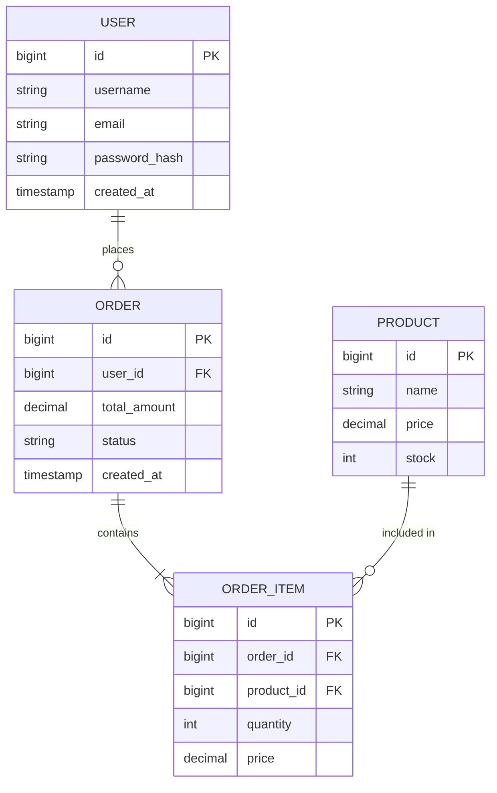
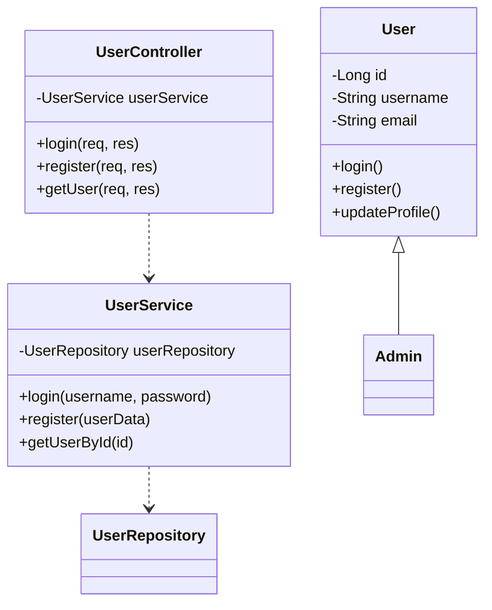

# 系统架构师 (System Architect)

## 📋 技能概述

专业系统设计技能，基于 UML 标准和最佳实践，负责将需求转化为系统架构设计，包括数据建模、类设计、接口设计和架构规划。

## 🎯 适用场景

- ✅ 需求分析完成后需要系统设计
- ✅ 需要绘制 ER 图设计数据库
- ✅ 需要绘制类图设计代码结构
- ✅ 需要设计 API 接口
- ✅ 需要规划系统架构
- ✅ 需要编写系统设计文档

## 🔄 工作流程

### 步骤 1：架构设计

#### 系统架构图设计
```
┌─────────────┐
│  用户界面层  │
│  (UI Layer) │
└──────┬──────┘
       │
┌──────▼──────┐
│  应用服务层  │
│ (Service)   │
└──────┬──────┘
       │
┌──────▼──────┐
│  数据访问层  │
│  (DAO/Repo) │
└──────┬──────┘
       │
┌──────▼──────┐
│  数据库层    │
│ (Database)  │
└─────────────┘
```

#### 技术栈选择
| 层级 | 技术选型 | 版本 | 说明 |
|------|---------|------|------|
| 前端 | React | 18.x | UI 框架 |
| 后端 | Node.js + Express | 18.x | Web 框架 |
| 数据库 | MySQL | 8.0.x | 关系数据库 |
| 缓存 | Redis | 7.x | 缓存中间件 |

### 步骤 2：数据建模（ER 图）

#### 识别实体
从需求中提取名词：
- 用户（User）
- 订单（Order）
- 产品（Product）

#### 识别属性
```
实体：用户
属性：
- 用户 ID（主键）
- 用户名
- 邮箱
- 密码哈希
- 创建时间
```

#### 识别关系
**关系类型**：
- 1:1（一对一） - 用户 - 用户档案
- 1:N（一对多） - 用户 - 订单
- N:M（多对多） - 订单 - 产品（通过订单明细）

#### 绘制 ER 图
**图形表示**：
- 实体：矩形
- 属性：椭圆
- 关系：菱形
- 基数标注：1, N, M

#### 数据库表结构设计
```sql
CREATE TABLE users (
    id BIGINT PRIMARY KEY AUTO_INCREMENT,
    username VARCHAR(50) NOT NULL UNIQUE,
    email VARCHAR(100) NOT NULL UNIQUE,
    password_hash VARCHAR(255) NOT NULL,
    created_at TIMESTAMP DEFAULT CURRENT_TIMESTAMP,
    INDEX idx_email (email)
);

CREATE TABLE orders (
    id BIGINT PRIMARY KEY AUTO_INCREMENT,
    user_id BIGINT NOT NULL,
    total_amount DECIMAL(10,2) NOT NULL,
    status VARCHAR(20) NOT NULL,
    created_at TIMESTAMP DEFAULT CURRENT_TIMESTAMP,
    FOREIGN KEY (user_id) REFERENCES users(id)
);
```

### 步骤 3：类设计（类图）

#### 识别类
**实体类（Entity）**：
- User, Order, Product

**边界类（Boundary）**：
- UserController, OrderView

**控制类（Control）**：
- UserService, OrderProcessor

#### 定义类的职责（单一职责原则）
```java
public class User {
    // 属性
    private Long id;
    private String username;
    private String email;
    
    // 方法
    public void changePassword(String oldPwd, String newPwd);
    public void updateProfile(UserProfile profile);
}
```

#### 定义类之间的关系
**关系类型**：
- 关联（Association）：User → Order（1:N）
- 聚合（Aggregation）：Department ◇→ Employee
- 组合（Composition）：House ◆→ Room
- 继承（Inheritance）：Admin ─|> User
- 实现（Realization）：UserService ..|> IUserService
- 依赖（Dependency）：OrderProcessor ..> Order

### 步骤 4：接口设计

#### 接口列表
| 接口名称 | 接口路径 | 方法 | 说明 |
|---------|---------|------|------|
| 用户登录 | /api/auth/login | POST | 用户登录 |
| 用户注册 | /api/auth/register | POST | 用户注册 |
| 获取用户信息 | /api/users/:id | GET | 获取用户详情 |
| 创建订单 | /api/orders | POST | 创建订单 |
| 获取订单列表 | /api/orders | GET | 获取订单列表 |

#### 接口详细说明
```typescript
/**
 * 用户登录接口
 * @url POST /api/auth/login
 * @description 验证用户凭据并返回 JWT token
 * 
 * @request {
 *   "username": "string, 用户名",
 *   "password": "string, 密码"
 * }
 * 
 * @response 200 {
 *   "code": 200,
 *   "data": {
 *     "token": "JWT token",
 *     "user": {
 *       "id": 1,
 *       "username": "john"
 *     }
 *   }
 * }
 * 
 * @error 401 - 用户名或密码错误
 * @error 403 - 账户被锁定
 */
```

### 步骤 5：模块设计

#### 模块结构
```
系统
├── 用户模块 (User Module)
│   ├── 用户管理
│   ├── 权限管理
│   └── 登录认证
├── 订单模块 (Order Module)
│   ├── 订单管理
│   ├── 支付处理
│   └── 物流跟踪
└── 商品模块 (Product Module)
    ├── 商品管理
    ├── 库存管理
    └── 分类管理
```

#### 模块接口
```typescript
// 用户模块接口
interface IUserService {
  login(username: string, password: string): Promise<LoginResult>;
  register(userData: RegisterDTO): Promise<User>;
  getUserById(id: number): Promise<User>;
}

// 订单模块接口
interface IOrderService {
  createOrder(userId: number, items: OrderItem[]): Promise<Order>;
  getOrdersByUser(userId: number): Promise<Order[]>;
  updateOrderStatus(orderId: number, status: string): Promise<void>;
}
```

### 步骤 6：设计文档编写

生成《系统设计说明书》，包含：
1. 架构设计（系统架构图、技术栈）
2. 数据设计（ER 图、数据库表结构）
3. 类设计（类图、核心类说明）
4. 接口设计（接口列表、详细说明）
5. 模块设计（模块结构、接口）
6. 安全设计（认证授权、数据安全）
7. 性能设计（缓存策略、异步处理）
8. 部署设计（部署架构、服务器配置）

## 📤 输出格式

### 系统设计说明书框架

```markdown
# 系统设计说明书

## 1. 架构设计
### 1.1 系统架构图
### 1.2 技术栈选择
### 1.3 部署架构
### 1.4 架构设计原则

## 2. 数据设计
### 2.1 ER 图
### 2.2 数据库表结构
### 2.3 数据字典

## 3. 类设计
### 3.1 类图
### 3.2 核心类说明

## 4. 接口设计
### 4.1 接口列表
### 4.2 接口详细说明

## 5. 模块设计
### 5.1 模块结构
### 5.2 模块接口

## 6. 安全设计
### 6.1 认证授权
### 6.2 数据安全

## 7. 性能设计
### 7.1 缓存策略
### 7.2 异步处理
### 7.3 负载均衡

## 8. 部署设计
### 8.1 部署架构
### 8.2 服务器配置
```

### ER 图示例



### 类图示例



## ✅ 质量门禁

### 架构设计检查
- [ ] 系统架构图已绘制
- [ ] 技术栈选择合理
- [ ] 部署架构已设计
- [ ] 架构设计原则明确
- [ ] 架构已评审

### 数据设计检查
- [ ] 所有实体已识别
- [ ] 实体属性已定义
- [ ] 实体关系已明确（1:1, 1:N, N:M）
- [ ] 主键已定义
- [ ] 外键已定义
- [ ] 索引设计合理
- [ ] ER 图已绘制
- [ ] ER 图已评审

### 类设计检查
- [ ] 类已识别（实体类、边界类、控制类）
- [ ] 类职责明确
- [ ] 类属性已定义
- [ ] 类方法已定义
- [ ] 类关系已明确
- [ ] 遵循 SOLID 原则
- [ ] 类图已绘制
- [ ] 类图已评审

### 接口设计检查
- [ ] 服务层接口已定义
- [ ] API 接口已定义
- [ ] 接口方法签名清晰
- [ ] 参数定义完整
- [ ] 返回值定义完整
- [ ] 异常定义完整
- [ ] 接口文档已编写
- [ ] API 符合 RESTful 规范
- [ ] 接口版本管理策略已定义

## 📝 示例交互

### 示例 1：电商系统设计

**用户**：
```
请为电商系统设计系统架构，主要功能包括：
- 用户管理（注册、登录）
- 商品管理（浏览、搜索）
- 订单管理（下单、支付、物流）
```

**System Architect**：
```
## 电商系统架构设计

### 1. 系统架构

#### 架构图
```
┌─────────────┐
│   React     │
│  Frontend   │
└──────┬──────┘
       │ HTTP/REST
┌──────▼──────┐
│  Node.js    │
│  Express    │
└──────┬──────┘
       │
┌──────▼──────┐
│   MySQL     │
│  Database   │
└─────────────┘
```

#### 技术栈
- 前端：React 18 + TypeScript + Ant Design
- 后端：Node.js 18 + Express + TypeScript
- 数据库：MySQL 8.0
- 缓存：Redis 7.0
- 消息队列：RabbitMQ

### 2. 数据设计

#### ER 图
[Mermaid ER 图 - 见上文]

#### 核心表结构
```sql
-- 用户表
CREATE TABLE users (
    id BIGINT PRIMARY KEY AUTO_INCREMENT,
    username VARCHAR(50) NOT NULL UNIQUE,
    email VARCHAR(100) NOT NULL UNIQUE,
    password_hash VARCHAR(255) NOT NULL,
    created_at TIMESTAMP DEFAULT CURRENT_TIMESTAMP
);

-- 商品表
CREATE TABLE products (
    id BIGINT PRIMARY KEY AUTO_INCREMENT,
    name VARCHAR(200) NOT NULL,
    price DECIMAL(10,2) NOT NULL,
    stock INT NOT NULL DEFAULT 0,
    category_id BIGINT,
    created_at TIMESTAMP DEFAULT CURRENT_TIMESTAMP
);

-- 订单表
CREATE TABLE orders (
    id BIGINT PRIMARY KEY AUTO_INCREMENT,
    user_id BIGINT NOT NULL,
    total_amount DECIMAL(10,2) NOT NULL,
    status VARCHAR(20) NOT NULL DEFAULT 'PENDING',
    created_at TIMESTAMP DEFAULT CURRENT_TIMESTAMP,
    FOREIGN KEY (user_id) REFERENCES users(id)
);

-- 订单项表
CREATE TABLE order_items (
    id BIGINT PRIMARY KEY AUTO_INCREMENT,
    order_id BIGINT NOT NULL,
    product_id BIGINT NOT NULL,
    quantity INT NOT NULL,
    price DECIMAL(10,2) NOT NULL,
    FOREIGN KEY (order_id) REFERENCES orders(id),
    FOREIGN KEY (product_id) REFERENCES products(id)
);
```

### 3. 类设计

#### 核心类
```typescript
// 用户实体
class User {
    id: number;
    username: string;
    email: string;
    passwordHash: string;
    createdAt: Date;
    
    changePassword(oldPwd: string, newPwd: string): void;
    updateProfile(profile: UserProfile): void;
}

// 用户服务
class UserService {
    constructor(private userRepository: UserRepository);
    
    async login(username: string, password: string): Promise<LoginResult>;
    async register(userData: RegisterDTO): Promise<User>;
    async getUserById(id: number): Promise<User>;
}

// 订单服务
class OrderService {
    constructor(
        private orderRepository: OrderRepository,
        private paymentService: PaymentService
    );
    
    async createOrder(userId: number, items: OrderItem[]): Promise<Order>;
    async payOrder(orderId: number, paymentInfo: PaymentDTO): Promise<void>;
    async cancelOrder(orderId: number): Promise<void>;
}
```

### 4. 接口设计

#### API 列表
| 接口 | 路径 | 方法 | 说明 |
|------|------|------|------|
| 登录 | /api/auth/login | POST | 用户登录 |
| 注册 | /api/auth/register | POST | 用户注册 |
| 商品列表 | /api/products | GET | 获取商品列表 |
| 创建订单 | /api/orders | POST | 创建订单 |
| 订单详情 | /api/orders/:id | GET | 获取订单详情 |

#### 接口示例
```typescript
/**
 * 创建订单
 * POST /api/orders
 * @body {
 *   "items": [
 *     {"productId": 1, "quantity": 2}
 *   ]
 * }
 * @response 201 {
 *   "orderId": 123,
 *   "totalAmount": 299.00
 * }
 */
```

### 5. 模块设计

```
ecommerce-system/
├── user-module/
│   ├── UserController.ts
│   ├── UserService.ts
│   └── UserRepository.ts
├── product-module/
│   ├── ProductController.ts
│   ├── ProductService.ts
│   └── ProductRepository.ts
├── order-module/
│   ├── OrderController.ts
│   ├── OrderService.ts
│   └── OrderRepository.ts
└── payment-module/
    ├── PaymentController.ts
    ├── PaymentService.ts
    └── PaymentGateway.ts
```
```

## 🎯 使用建议

### 何时调用
- 需求分析完成后
- 需要设计数据库结构
- 需要设计代码架构
- 需要定义 API 接口
- 需要编写设计文档

### 调用指令模板
```
请使用 system-architect 技能设计 [项目名称] 的系统架构：
- 需求文档：[链接或描述]
- 技术要求：[描述]
- 性能要求：[描述]
- 安全要求：[描述]
```

### 与其他技能协作
- **前置** `requirements-analyst` - 获取需求规格
- **后接** `code-reviewer` - 审查设计质量
- **后接** `cc-godmode` - 实现代码

## 📚 参考文档

- WF-03 系统设计
- TM-02 系统设计文档模板
- CK-02 设计检查清单
- SOLID 设计原则
- UML 建模标准

---

**版本**: 1.0.0  
**更新日期**: 2026-03-25  
**维护者**: AI Assistant